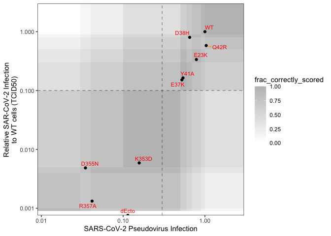

ACE2\_variants
================
Kenneth Matreyek
12/28/2020

``` r
rm(list = ls())
if(!requireNamespace("tidyverse")){install.packages("tidyverse")};library(tidyverse)
```

    ## Loading required namespace: tidyverse

    ## ── Attaching packages ─────────────────────────────────────── tidyverse 1.3.0 ──

    ## ✓ ggplot2 3.3.2     ✓ purrr   0.3.4
    ## ✓ tibble  3.0.1     ✓ dplyr   1.0.0
    ## ✓ tidyr   1.1.0     ✓ stringr 1.4.0
    ## ✓ readr   1.3.1     ✓ forcats 0.5.0

    ## ── Conflicts ────────────────────────────────────────── tidyverse_conflicts() ──
    ## x dplyr::filter() masks stats::filter()
    ## x dplyr::lag()    masks stats::lag()

``` r
if(!requireNamespace("ggrepel")){install.packages("ggrepel")};library(ggrepel)
```

    ## Loading required namespace: ggrepel

``` r
if(!requireNamespace("patchwork")){install.packages("patchwork")};library(patchwork)
```

    ## Loading required namespace: patchwork

``` r
set.seed(123)

virus_label_factors <- c("VSVG","SARS1", "SARS2", "SARS2_min", "d19", "d19_min", "RRAR>A(Furin)", "P812R","D614G")
virus_colors <- c("VSVG" = "red", "SARS1" = "darkgreen", "SARS2" = "blue")

to_single_notation <- function(arg1){
  if(toupper(arg1) == "ALA"){return("A")};if(toupper(arg1) == "CYS"){return("C")};if(toupper(arg1) == "ASP"){return("D")};if(toupper(arg1) == "GLU"){return("E")};if(toupper(arg1) == "PHE"){return("F")};if(toupper(arg1) == "GLY"){return("G")};if(toupper(arg1) == "HIS"){return("H")};if(toupper(arg1) == "ILE"){return("I")};if(toupper(arg1) == "LYS"){return("K")};if(toupper(arg1) == "LEU"){return("L")};if(toupper(arg1) == "MET"){return("M")};if(toupper(arg1) == "ASN"){return("N")};if(toupper(arg1) == "PRO"){return("P")};if(toupper(arg1) == "GLN"){return("Q")};if(toupper(arg1) == "ARG"){return("R")};if(toupper(arg1) == "SER"){return("S")};if(toupper(arg1) == "THR"){return("T")};if(toupper(arg1) == "VAL"){return("V")};if(toupper(arg1) == "TRP"){return("W")};if(toupper(arg1) == "TYR"){return("Y")};if(toupper(arg1) == "TER"){return("X")}
}
```

``` r
recombined_construct_key <- read.csv(file = "Data/Keys/Construct_label_key.csv", header = T, stringsAsFactors = F)
pseudovirus_label_key <- read.csv(file = "Data/Keys/pseudovirus_label_key.csv", header = T, stringsAsFactors = F) %>% filter(sequence_confirmed != "flawed")

staining_data <- merge(read.csv(file = "Data/Staining_data.csv", header = T, stringsAsFactors = F), recombined_construct_key, by = "recombined_construct") %>% arrange(date)
infection_data <- merge(read.csv(file = "Data/Ace2_variant_infection_data.csv", header = T, stringsAsFactors = F), recombined_construct_key, by = "recombined_construct") %>% arrange(date)
```

## Introducing LLP Int-iCasp9-Blast

``` r
llp_comparison1 <- read.csv(file = "Data/Flow_cytometry/Int-iCasp9-Blast/Int-iCasp9-Blast_200317.csv", header = T, stringsAsFactors = F)
llp_comparison2 <- read.csv(file = "Data/Flow_cytometry/Int-iCasp9-Blast/Int-iCasp9-Blast_200624.csv", header = T, stringsAsFactors = F)
llp_comparison3 <- read.csv(file = "Data/Flow_cytometry/Int-iCasp9-Blast/Int-iCasp9-Blast_200702.csv", header = T, stringsAsFactors = F)
llp_comparison4 <- read.csv(file = "Data/Flow_cytometry/Int-iCasp9-Blast/Int-iCasp9-Blast_200706.csv", header = T, stringsAsFactors = F)

colnames(llp_comparison3) <- colnames(llp_comparison2);colnames(llp_comparison4) <- colnames(llp_comparison2)
llp_comparison_combined <- rbind(llp_comparison1, llp_comparison2, llp_comparison3, llp_comparison4)

llp_comparison_combined$cells <- factor(llp_comparison_combined$cells, levels = c("Int-Blast","iCasp9-Blast","Int-iCasp9-Blast"))
llp_comparison_combined$bxb1 <- factor(llp_comparison_combined$bxb1, levels = c("none","added"))
llp_comparison_combined$selection <- factor(llp_comparison_combined$selection, levels = c("None","AP1903"))
llp_comparison_combined$single_recombinants <- llp_comparison_combined$red + llp_comparison_combined$green
llp_comparison_combined$count <- 1

llp_comparison_summary <- llp_comparison_combined %>% group_by(cells, bxb1, selection) %>% summarize(mean = mean(single_recombinants), sd = sd(single_recombinants), count = sum(count), .groups = 'drop')
llp_comparison_summary$upper_ci <- llp_comparison_summary$mean + llp_comparison_summary$sd/sqrt(llp_comparison_summary$count -1) * 1.96
llp_comparison_summary$lower_ci <- llp_comparison_summary$mean - llp_comparison_summary$sd/sqrt(llp_comparison_summary$count -1) * 1.96

llp_comparison_summary[llp_comparison_summary$lower_ci < 0,"lower_ci"] <- 0

LLP_comparison_plot <- ggplot() + theme_bw() + 
  theme(axis.text.x = element_text(angle = 45, hjust = 1, vjust = 1), panel.grid.major.x = element_blank(), legend.position = "none") + 
  scale_y_continuous(limits = c(0,105), expand = c(0,0.5)) +
  geom_hline(yintercept = 0, size = 2, alpha = 0.2) +
  geom_errorbar(data = llp_comparison_summary, aes(x = cells, ymin = lower_ci, ymax = upper_ci, group = bxb1), alpha = 0.4, width = 0.2, position = position_dodge(width = 0.4)) +
  geom_jitter(data = llp_comparison_combined, aes(x = cells, y = single_recombinants, color = bxb1), position = position_dodge(width = 0.4), alpha = 0.4) +
  geom_point(data = llp_comparison_summary, aes(x = cells, y = mean, color = bxb1), position = position_dodge(width = 0.4), size = 8, shape = 95) +
  facet_grid(cols = vars(selection)) +
  scale_shape_manual(values = c(1,16)) +
  xlab(NULL) + ylab("Percent single recombinants")
LLP_comparison_plot
```

<!-- -->

``` r
ggsave(file = "Plots/LLP_comparison_plot.pdf", LLP_comparison_plot, height = 2.25, width = 3)

paste("The LLP-int-iCasp9-Blast cell line yielded", round(mean((llp_comparison_combined %>% filter(cells == "Int-iCasp9-Blast" & selection == "None"))$single_recombinants),1),"% recombination")
```

    ## [1] "The LLP-int-iCasp9-Blast cell line yielded 12.5 % recombination"

``` r
paste("The LLP-int-iCasp9-Blast cell line yielded", round(mean((llp_comparison_combined %>% filter(cells == "Int-iCasp9-Blast" & selection == "AP1903"))$single_recombinants),1),"% recombinanants after negative selection")
```

    ## [1] "The LLP-int-iCasp9-Blast cell line yielded 74.2 % recombinanants after negative selection"

## Flow cytometry of the various ACE2 expression constructs

``` r
d200710_none <- read.csv(file = "Data/Flow_cytometry/Constructs/200710_None.csv", header = T, stringsAsFactors = F) %>% mutate(date = "200710", recombined_construct = "None", mfi_grn = GFP.A, mfi_red = mCherry.A)
d200710_g627b <- read.csv(file = "Data/Flow_cytometry/Constructs/200710_G627B.csv", header = T, stringsAsFactors = F) %>% mutate(date = "200710", recombined_construct = "G627B", mfi_grn = GFP.A, mfi_red = mCherry.A)
d200710_g698c <- read.csv(file = "Data/Flow_cytometry/Constructs/200710_G698C.csv", header = T, stringsAsFactors = F) %>% mutate(date = "200710", recombined_construct = "G698C", mfi_grn = GFP.A, mfi_red = mCherry.A)
d200710_g714c <- read.csv(file = "Data/Flow_cytometry/Constructs/200710_G714C.csv", header = T, stringsAsFactors = F) %>% mutate(date = "200710", recombined_construct = "G714C", mfi_grn = GFP.A, mfi_red = mCherry.A)
d200710_g719b <- read.csv(file = "Data/Flow_cytometry/Constructs/200710_G719B.csv", header = T, stringsAsFactors = F) %>% mutate(date = "200710", recombined_construct = "G719B", mfi_grn = GFP.A, mfi_red = mCherry.A)
d200714_none <- read.csv(file = "Data/Flow_cytometry/Constructs/200714_None.csv", header = T, stringsAsFactors = F) %>% mutate(date = "200714", recombined_construct = "None", mfi_grn = GFP.A, mfi_red = mCherry.A)
d200714_g627b <- read.csv(file = "Data/Flow_cytometry/Constructs/200714_G627B.csv", header = T, stringsAsFactors = F) %>% mutate(date = "200714", recombined_construct = "G627B", mfi_grn = GFP.A, mfi_red = mCherry.A)
d200714_g698c <- read.csv(file = "Data/Flow_cytometry/Constructs/200714_G698C.csv", header = T, stringsAsFactors = F) %>% mutate(date = "200714", recombined_construct = "G698C", mfi_grn = GFP.A, mfi_red = mCherry.A)
d200714_g714c <- read.csv(file = "Data/Flow_cytometry/Constructs/200714_G714C.csv", header = T, stringsAsFactors = F) %>% mutate(date = "200714", recombined_construct = "G714C", mfi_grn = GFP.A, mfi_red = mCherry.A)
d200714_g719b <- read.csv(file = "Data/Flow_cytometry/Constructs/200714_G719B.csv", header = T, stringsAsFactors = F) %>% mutate(date = "200714", recombined_construct = "G719B", mfi_grn = GFP.A, mfi_red = mCherry.A)
d200716_none <- read.csv(file = "Data/Flow_cytometry/Constructs/200716_None.csv", header = T, stringsAsFactors = F) %>% mutate(date = "200716", recombined_construct = "None", mfi_grn = GFP.A, mfi_red = mCherry.A)
d200716_g627b <- read.csv(file = "Data/Flow_cytometry/Constructs/200716_G627B.csv", header = T, stringsAsFactors = F) %>% mutate(date = "200716", recombined_construct = "G627B", mfi_grn = GFP.A, mfi_red = mCherry.A)
d200716_g698c <- read.csv(file = "Data/Flow_cytometry/Constructs/200716_G698C.csv", header = T, stringsAsFactors = F) %>% mutate(date = "200716", recombined_construct = "G698C", mfi_grn = GFP.A, mfi_red = mCherry.A)
d200716_g714c <- read.csv(file = "Data/Flow_cytometry/Constructs/200716_G714C.csv", header = T, stringsAsFactors = F) %>% mutate(date = "200716", recombined_construct = "G714C", mfi_grn = GFP.A, mfi_red = mCherry.A)
d200716_g719b <- read.csv(file = "Data/Flow_cytometry/Constructs/200716_G719B.csv", header = T, stringsAsFactors = F) %>% mutate(date = "200716", recombined_construct = "G719B", mfi_grn = GFP.A, mfi_red = mCherry.A)
d200721_none <- read.csv(file = "Data/Flow_cytometry/Constructs/200721_None.csv", header = T, stringsAsFactors = F) %>% mutate(date = "200721", recombined_construct = "None", mfi_grn = B525.A, mfi_red = YG610.A, dox = "Dox")
d200721_g627b <- read.csv(file = "Data/Flow_cytometry/Constructs/200721_G627B.csv", header = T, stringsAsFactors = F) %>% mutate(date = "200721", recombined_construct = "G627B", mfi_grn = B525.A, mfi_red = YG610.A, dox = "Dox")
d200721_g698c <- read.csv(file = "Data/Flow_cytometry/Constructs/200721_G698C.csv", header = T, stringsAsFactors = F) %>% mutate(date = "200721", recombined_construct = "G698C", mfi_grn = B525.A, mfi_red = YG610.A, dox = "Dox")
d200721_g714c <- read.csv(file = "Data/Flow_cytometry/Constructs/200721_G714C.csv", header = T, stringsAsFactors = F) %>% mutate(date = "200721", recombined_construct = "G714C", mfi_grn = B525.A, mfi_red = YG610.A, dox = "Dox")
d200721_g719b <- read.csv(file = "Data/Flow_cytometry/Constructs/200721_G719B.csv", header = T, stringsAsFactors = F) %>% mutate(date = "200721", recombined_construct = "G719B", mfi_grn = B525.A, mfi_red = YG610.A, dox = "Dox")
d200724_none <- read.csv(file = "Data/Flow_cytometry/Constructs/200724_None.csv", header = T, stringsAsFactors = F) %>% mutate(date = "200724", recombined_construct = "None", mfi_grn = B525.A, mfi_red = YG610.A)
d200724_g627b <- read.csv(file = "Data/Flow_cytometry/Constructs/200724_G627B.csv", header = T, stringsAsFactors = F) %>% mutate(date = "200724", recombined_construct = "G627B", mfi_grn = B525.A, mfi_red = YG610.A)
d200724_g698c <- read.csv(file = "Data/Flow_cytometry/Constructs/200724_G698C.csv", header = T, stringsAsFactors = F) %>% mutate(date = "200724", recombined_construct = "G698C", mfi_grn = B525.A, mfi_red = YG610.A)
d200724_g714c <- read.csv(file = "Data/Flow_cytometry/Constructs/200724_G714C.csv", header = T, stringsAsFactors = F) %>% mutate(date = "200724", recombined_construct = "G714C", mfi_grn = B525.A, mfi_red = YG610.A)
d200724_g719b <- read.csv(file = "Data/Flow_cytometry/Constructs/200724_G719B.csv", header = T, stringsAsFactors = F) %>% mutate(date = "200724", recombined_construct = "G719B", mfi_grn = B525.A, mfi_red = YG610.A)

staining_columns <- c("date","recombined_construct","mfi_grn","mfi_red")

staining_datapoints <- rbind(d200710_none[,staining_columns],d200710_g627b[,staining_columns],d200710_g698c[,staining_columns],d200710_g714c[,staining_columns],d200710_g719b[,staining_columns],
                             d200714_none[,staining_columns],d200714_g627b[,staining_columns],d200714_g698c[,staining_columns],d200714_g714c[,staining_columns],d200714_g719b[,staining_columns],
                             d200716_none[,staining_columns],d200716_g627b[,staining_columns],d200716_g698c[,staining_columns],d200716_g714c[,staining_columns],d200716_g719b[,staining_columns],
                             d200721_none[,staining_columns],d200721_g627b[,staining_columns],d200721_g698c[,staining_columns],d200721_g714c[,staining_columns],d200721_g719b[,staining_columns],
                             d200724_none[,staining_columns],d200724_g627b[,staining_columns],d200724_g698c[,staining_columns],d200724_g714c[,staining_columns],d200724_g719b[,staining_columns])

## This part here is showing what the mCherry flow profiles look like between the Dox and NoDox conditions
d200721_none_noDox <- read.csv(file = "Data/Flow_cytometry/Constructs/200721_None_noDox.csv", header = T, stringsAsFactors = F) %>% mutate(date = "200721", recombined_construct = "None", mfi_grn = B525.A, mfi_red = YG610.A, dox = "noDox")
d200721_g627b_noDox <- read.csv(file = "Data/Flow_cytometry/Constructs/200721_G627B_noDox.csv", header = T, stringsAsFactors = F) %>% mutate(date = "200721", recombined_construct = "G627B", mfi_grn = B525.A, mfi_red = YG610.A, dox = "noDox")
d200721_g698c_noDox <- read.csv(file = "Data/Flow_cytometry/Constructs/200721_G698C_noDox.csv", header = T, stringsAsFactors = F) %>% mutate(date = "200721", recombined_construct = "G698C", mfi_grn = B525.A, mfi_red = YG610.A, dox = "noDox")
d200721_g714c_noDox <- read.csv(file = "Data/Flow_cytometry/Constructs/200721_G714C_noDox.csv", header = T, stringsAsFactors = F) %>% mutate(date = "200721", recombined_construct = "G714C", mfi_grn = B525.A, mfi_red = YG610.A, dox = "noDox")
d200721_g719b_noDox <- read.csv(file = "Data/Flow_cytometry/Constructs/200721_G719B_noDox.csv", header = T, stringsAsFactors = F) %>% mutate(date = "200721", recombined_construct = "G719B", mfi_grn = B525.A, mfi_red = YG610.A, dox = "noDox")

staining_columns2 <- c("date","recombined_construct","dox","mfi_grn","mfi_red")

Dox_noDox_dataset <- rbind(d200721_none_noDox[,staining_columns2], d200721_none[,staining_columns2],
                           d200721_g627b_noDox[,staining_columns2], d200721_g627b[,staining_columns2],
                           d200721_g698c_noDox[,staining_columns2], d200721_g698c[,staining_columns2],
                           d200721_g714c_noDox[,staining_columns2], d200721_g714c[,staining_columns2],
                           d200721_g719b_noDox[,staining_columns2], d200721_g719b[,staining_columns2])
Dox_noDox_dataset2 <- merge(Dox_noDox_dataset, recombined_construct_key[,c("recombined_construct","cell_label")], by = "recombined_construct") %>% filter(mfi_red >= 10)

Dox_noDox_dataset2$cell_label <- factor(Dox_noDox_dataset2$cell_label, levels = c("None","ACE2","ACE2(IRES-mCherry)","ACE2-T2A-mCherry","ACE2-mCherry"))

Dox_noDox_histogram_plot <- ggplot() + theme_bw() + 
  theme(panel.grid.minor.y = element_blank(), panel.grid.major.y = element_blank(), legend.position = "none", strip.text.y.right = element_text(angle = 0)) + 
  scale_x_log10(expand = c(0,0.1), breaks = c(1,1e3,1e5)) + scale_y_continuous(breaks = c(0,1000,2000)) +
  scale_fill_manual(values = c("black","orange")) + 
  labs(x = "Red mean fluorescence intensity", y = "Number of cells") +
  geom_histogram(data = Dox_noDox_dataset2, aes(x = mfi_red, fill = dox), bins = 100, alpha = 0.6, position="identity") +
  facet_grid(rows = vars(cell_label))
Dox_noDox_histogram_plot
```

<!-- -->

``` r
ggsave(file = "Plots/Dox_noDox_histogram_plot.pdf", Dox_noDox_histogram_plot, height = 3, width = 3)
```

``` r
## Making a scatterplot comparing G698C red fluorescence and cell surface ACE2

double_positive_subset <- d200721_g698c %>% filter(mfi_grn > 3e2 & mfi_red > 1e3)

lm_mfi_grn_mfi_red <- lm(log10(double_positive_subset$mfi_grn) ~ log10(double_positive_subset$mfi_red))
double_pos_lm_line <- data.frame("log_mfi_red" = c(log10(1e3),log10(1e5)))
double_pos_lm_line$log_mfi_grn = double_pos_lm_line$log_mfi_red * lm_mfi_grn_mfi_red$coefficient[2] + lm_mfi_grn_mfi_red$coefficient[1]
double_pos_lm_line$mfi_red <- 10^double_pos_lm_line$log_mfi_red; double_pos_lm_line$mfi_grn <- 10^double_pos_lm_line$log_mfi_grn

G698C_cell_scatterplot <- ggplot() + theme_bw() + theme(panel.grid.minor = element_blank(), panel.grid.major = element_blank()) +
  labs(x = "Red MFI", y = "Green MFI") +
  scale_x_log10(limits = c(10,1e5)) + scale_y_log10(limits = c(10,1e5)) +
  geom_hline(yintercept = 3e2, linetype = 2) + geom_vline(xintercept = 1e3, linetype = 2) +
  geom_point(data = d200721_g698c, aes(x = mfi_red, y = mfi_grn), alpha = 0.01) +
  geom_point(data = d200721_g698c_noDox, aes(x = mfi_red, y = mfi_grn), color = "orange", alpha = 0.01) + 
  geom_segment(data = NULL, aes(x = double_pos_lm_line$mfi_red[1], xend = double_pos_lm_line$mfi_red[2],
                                y = double_pos_lm_line$mfi_grn[1], yend = double_pos_lm_line$mfi_grn[2]),
               size = 4, alpha = 0.4, color = "green")
G698C_cell_scatterplot
```

    ## Warning in self$trans$transform(x): NaNs produced

    ## Warning: Transformation introduced infinite values in continuous x-axis

    ## Warning in self$trans$transform(x): NaNs produced

    ## Warning: Transformation introduced infinite values in continuous y-axis

    ## Warning in self$trans$transform(x): NaNs produced

    ## Warning: Transformation introduced infinite values in continuous x-axis

    ## Warning in self$trans$transform(x): NaNs produced

    ## Warning: Transformation introduced infinite values in continuous y-axis

    ## Warning: Removed 273 rows containing missing values (geom_point).

    ## Warning: Removed 1902 rows containing missing values (geom_point).

<!-- -->

``` r
ggsave(file = "Plots/G698C_cell_scatterplot.png", G698C_cell_scatterplot, height = 2, width = 3)
```

    ## Warning in self$trans$transform(x): NaNs produced

    ## Warning: Transformation introduced infinite values in continuous x-axis

    ## Warning in self$trans$transform(x): NaNs produced

    ## Warning: Transformation introduced infinite values in continuous y-axis

    ## Warning in self$trans$transform(x): NaNs produced

    ## Warning: Transformation introduced infinite values in continuous x-axis

    ## Warning in self$trans$transform(x): NaNs produced

    ## Warning: Transformation introduced infinite values in continuous y-axis

    ## Warning: Removed 273 rows containing missing values (geom_point).

    ## Warning: Removed 1902 rows containing missing values (geom_point).

``` r
paste("The Pearson's R^2 between green MFI and red MFI for cells in the double-positive quadrant was", round(cor(log10(double_positive_subset$mfi_grn), log10(double_positive_subset$mfi_red), method = "pearson", use = "complete.obs")^2,2))
```

    ## [1] "The Pearson's R^2 between green MFI and red MFI for cells in the double-positive quadrant was 0.44"

``` r
## The part below is figuring out how well the mCherry expression reports on ACE2 cell surface expression\
staining_experiment_date_list <- unique(staining_datapoints$date)
staining_experiment_sample_list <- unique(staining_datapoints$recombined_construct)

staining_summary_frame <- data.frame("date" = rep(staining_experiment_date_list, each = 5),
                                     "recombined_construct" = rep(staining_experiment_sample_list, 5))
## I will be counting 1e3 as the cutoff for calling something green+ or red+
staining_summary_frame$pct_red <- 0
staining_summary_frame$pct_red_also_grn <- 0
staining_summary_frame$cell_count <- 0
staining_summary_frame$n <- 1

for(x in 1:nrow(staining_summary_frame)){
  temp_data <- staining_datapoints %>% filter(date == staining_summary_frame$date[x], recombined_construct == staining_summary_frame$recombined_construct[x])
  staining_summary_frame$pct_red[x] <- sum(temp_data$mfi_red > 1e3)/nrow(temp_data) * 100
  staining_summary_frame$pct_red_also_grn[x] <- sum(temp_data$mfi_red > 1e3 & temp_data$mfi_grn > 3e2)/sum(temp_data$mfi_red > 1e3) * 100
  staining_summary_frame$cell_count[x] <- nrow(temp_data)
}

staining_summary_frame2 <- staining_summary_frame %>% filter(recombined_construct != "None") %>% group_by(recombined_construct) %>% summarize(mean_pct_red_also_grn = mean(pct_red_also_grn), sd_pct_red_also_grn = sd(pct_red_also_grn), n = sum(n), .groups = 'drop')
staining_summary_frame2$upper_ci <- staining_summary_frame2$mean_pct_red_also_grn + staining_summary_frame2$sd_pct_red_also_grn/sqrt(staining_summary_frame2$n - 1) * 1.96
staining_summary_frame2$lower_ci <- staining_summary_frame2$mean_pct_red_also_grn - staining_summary_frame2$sd_pct_red_also_grn/sqrt(staining_summary_frame2$n - 1) * 1.96

staining_summary_frame <- merge(staining_summary_frame, recombined_construct_key[,c("recombined_construct","cell_label")], by = "recombined_construct")
staining_summary_frame$cell_label <- factor(staining_summary_frame$cell_label, levels = rev(c("None","ACE2","ACE2(IRES-mCherry)","ACE2-T2A-mCherry","ACE2-mCherry")))

staining_summary_frame2 <- merge(staining_summary_frame2, recombined_construct_key[,c("recombined_construct","cell_label")], by = "recombined_construct")
staining_summary_frame2$cell_label <- factor(staining_summary_frame2$cell_label, levels = rev(c("None","ACE2","ACE2(IRES-mCherry)","ACE2-T2A-mCherry","ACE2-mCherry")))

Construct_mCherry_and_stain <- ggplot() + theme_bw() + coord_flip() + 
  scale_y_continuous(limits = c(0,100), expand = c(0,0.1)) +
  theme(panel.grid.minor.y = element_blank(), panel.grid.major.x = element_blank(), axis.text.x = element_text(angle = -90, hjust = 0, vjust = 0.5)) + 
  labs(x = element_blank(), y = "% Green+ within Red+ cells") +
  geom_hline(yintercept = 0, size = 2) +
  geom_errorbar(data = staining_summary_frame2, aes(x = cell_label, ymin = lower_ci, ymax = upper_ci), alpha = 0.2, width = 0.2, position = position_dodge(width = 0.4)) +
  geom_jitter(data = subset(staining_summary_frame, cell_label != "None"), aes(x = cell_label, y = pct_red_also_grn), position = position_dodge(width = 0.4), alpha = 0.4) +
  geom_point(data = staining_summary_frame2, aes(x = cell_label, y = mean_pct_red_also_grn), position = position_dodge(width = 0.4), size = 8, shape = 108)
Construct_mCherry_and_stain
```

<!-- -->

``` r
ggsave(file = "Plots/Construct_mCherry_and_stain.pdf", Construct_mCherry_and_stain, height = 2.8, width = 2.2)
```

``` r
staining_initial_constructs <- staining_data %>% filter(recombined_construct %in% c("None","G627B","G698C","G714C","G719B"))
for(x in 1:nrow(staining_initial_constructs)){if(staining_initial_constructs$recombined_construct[x] == "None"){staining_initial_constructs$mfi_grn[x] <- staining_initial_constructs$mfi_grn[x]}}

staining_initial_constructs$count <- 1
staining_initial_constructs$log10_mfi_grn <- log10(staining_initial_constructs$mfi_grn)

staining_initial_constructs_summary <- staining_initial_constructs %>% group_by(cell_label, pseudovirus_inoc) %>% summarize(mean_log10 = mean(log10_mfi_grn), sd_log10 = sd(log10_mfi_grn), n = sum(count), .groups = 'drop')
staining_initial_constructs_summary$geomean <- 10^staining_initial_constructs_summary$mean_log10
staining_initial_constructs_summary$upper_ci <- 10^(staining_initial_constructs_summary$mean_log10 + staining_initial_constructs_summary$sd_log10/sqrt(staining_initial_constructs_summary$n - 1)*1.96)
staining_initial_constructs_summary$lower_ci <- 10^(staining_initial_constructs_summary$mean_log10 - staining_initial_constructs_summary$sd_log10/sqrt(staining_initial_constructs_summary$n - 1)*1.96)

staining_initial_constructs$cell_label <- factor(staining_initial_constructs$cell_label, levels = c("None","ACE2","ACE2(IRES-mCherry)","ACE2-T2A-mCherry","ACE2-mCherry"))
staining_initial_constructs_summary$cell_label <- factor(staining_initial_constructs_summary$cell_label, levels = c("None","ACE2","ACE2(IRES-mCherry)","ACE2-T2A-mCherry","ACE2-mCherry"))

Initial_construct_staining <- ggplot() + theme_bw() + 
  theme(panel.grid.major.y = element_blank(), axis.text.x = element_text(angle = 0, hjust = 1, vjust = 1)) + coord_flip() + scale_x_discrete(limits = rev(levels(staining_initial_constructs_summary$cell_label))) +
  labs(x = element_blank(), y = "Green MFI") +
  scale_y_log10() + scale_color_manual(values = c("black","orange")) +
  geom_errorbar(data = staining_initial_constructs_summary, aes(x = cell_label, ymin = lower_ci, ymax = upper_ci, color = pseudovirus_inoc), alpha = 1, width = 0.4, position = position_dodge(width = 0.4)) +
  geom_jitter(data = staining_initial_constructs, aes(x = cell_label, y = mfi_grn, color = pseudovirus_inoc), position = position_dodge(width = 0.4), alpha = 0.4) +
  geom_point(data = staining_initial_constructs_summary, aes(x = cell_label, y = geomean, color = pseudovirus_inoc), position = position_dodge(width = 0.4), size = 8, shape = 124)
Initial_construct_staining
```

<!-- -->

``` r
ggsave(file = "Plots/Initial_construct_staining.pdf", Initial_construct_staining, height = 3.2, width = 4)

staining_initial_constructs_mini <- subset(staining_initial_constructs, cell_label %in% c("None","ACE2"))
staining_initial_constructs_summary_mini <- subset(staining_initial_constructs_summary, cell_label %in% c("None","ACE2"))

Initial_construct_staining_small <- ggplot() + theme_bw() + 
  theme(panel.grid.major.y = element_blank(), axis.text.x = element_text(angle = 0, hjust = 0.5, vjust = 1), legend.position = "none") + coord_flip() + scale_x_discrete(limits = rev(c("None","ACE2"))) +
  labs(x = element_blank(), y = "Red MFI") +
  scale_y_log10() + scale_color_manual(values = c("black","orange")) +
  geom_errorbar(data = staining_initial_constructs_summary_mini, aes(x = cell_label, ymin = lower_ci, ymax = upper_ci, color = pseudovirus_inoc), alpha = 1, width = 0.4, position = position_dodge(width = 0.6)) +
  geom_jitter(data = staining_initial_constructs_mini, aes(x = cell_label, y = mfi_grn, color = pseudovirus_inoc), position = position_dodge(width = 0.6), alpha = 0.4) +
  geom_point(data = staining_initial_constructs_summary_mini, aes(x = cell_label, y = geomean, color = pseudovirus_inoc), position = position_dodge(width = 0.6), size = 8, shape = 124)
Initial_construct_staining_small
```

<!-- -->

``` r
ggsave(file = "Plots/Initial_construct_staining_mini.pdf", Initial_construct_staining_small, height = 1.65, width = 1.2)
```

## Establishing the linear range of the GFP-reporter infection assay

``` r
dilution_data <- infection_data %>% filter(expt == "Dilutions")
dilution_expt_dates <- dilution_data %>% group_by(date, pseudovirus_env) %>% summarize(date = unique(date), pseudovirus_env = unique(pseudovirus_env), .groups = "drop")

dilution_expt_dates <- dilution_data %>% group_by(date, pseudovirus_env) %>% mutate(closest_to_pt1 = abs(moi - 0.03)) %>% slice_min(closest_to_pt1, n = 1)
dilution_expt_dates$fold_dilution_to_moi_pt1 <- dilution_expt_dates$moi / 0.1 ## May not need this

dilution_expt_dates$normalized_dilution <- 0
for(x in 1:nrow(dilution_data)){
  dilution_data$normalized_dilution[x] <- log10(as.numeric(as.numeric(dilution_data$pseudovirus_inoc[x]) / as.numeric(dilution_expt_dates[dilution_expt_dates$date == dilution_data$date[x] & dilution_expt_dates$pseudovirus_env == dilution_data$pseudovirus_env[x], "pseudovirus_inoc"]) * (dilution_expt_dates[dilution_expt_dates$date == dilution_data$date[x] & dilution_expt_dates$pseudovirus_env == dilution_data$pseudovirus_env[x], "moi"] / 0.2)))
}
dilution_data$date <- factor(dilution_data$date)

Dilution_plot2 <- ggplot() + theme_bw() + theme(legend.position = "none", panel.grid.minor = element_blank()) + 
  scale_x_continuous(limits = c(-3,1)) +
  scale_y_log10(limits = c(2e-2,100), breaks = c(0.001,0.01,0.1,1,10,100), expand = c(0,0)) +
  scale_color_manual(values = virus_colors) +
  xlab("Log10 dilution") + ylab("Percent GFP+") +
  geom_hline(yintercept = c(0.1,30), linetype = 2) +
  geom_abline(slope = 1.5, intercept = 1.9, alpha = 0.2, size = 6) +
  geom_line(data = dilution_data, aes(x = normalized_dilution, y = pct_grn_gvn_red, linetype = date), alpha = 0.4, size = 1, color = "darkgreen") +
  geom_point(data = dilution_data, aes(x = normalized_dilution, y = pct_grn_gvn_red, shape = date), alpha = 0.4, size = 2, color = "darkgreen")
Dilution_plot2
```

    ## Warning: Transformation introduced infinite values in continuous y-axis
    
    ## Warning: Transformation introduced infinite values in continuous y-axis

    ## Warning: Removed 22 row(s) containing missing values (geom_path).

    ## Warning: Removed 22 rows containing missing values (geom_point).

<!-- -->

``` r
ggsave(file = "Plots/Dilution_plot.pdf", Dilution_plot2, height = 1.8, width = 2)
```

    ## Warning: Transformation introduced infinite values in continuous y-axis

    ## Warning: Transformation introduced infinite values in continuous y-axis

    ## Warning: Removed 22 row(s) containing missing values (geom_path).

    ## Warning: Removed 22 rows containing missing values (geom_point).

``` r
constructs_combined <- infection_data %>% filter(expt == "Constructs") %>% mutate(moi = -log(1-pct_grn/100))
constructs_combined[constructs_combined$recombined_construct == "none","recombined_construct"] <- "None"

#for(x in 1:nrow(constructs_combined)){constructs_combined$moi[x] <- uniroot(moi_backcalc_fxn , y= constructs_combined$pct_grn[x] / 100, lower=0, upper=4)$root} #backcalc MOI

constructs_combined_summary <- constructs_combined %>% group_by(date, recombined_construct, pseudovirus_env) %>% summarize(moi = mean(moi), sd = sd(moi), .groups = "drop")

constructs_combined_summary2 <- merge(constructs_combined_summary, recombined_construct_key, by = "recombined_construct")  ## ALTERED THIS RECENTLY

for(x in 1:nrow(constructs_combined_summary2)){constructs_combined_summary2$scaled_infection[x] <- constructs_combined_summary2$moi[x]/(constructs_combined_summary2[constructs_combined_summary2$recombined_construct == "None" & constructs_combined_summary2$pseudovirus_env ==  constructs_combined_summary2$pseudovirus_env[x] & constructs_combined_summary2$date ==  constructs_combined_summary2$date[x],"moi"])}

constructs_combined_summary2$cell_label <- factor(constructs_combined_summary2$cell_label, levels = c("None","ACE2","ACE2(IRES-mCherry)","ACE2-T2A-mCherry","ACE2-mCherry"))

constructs_combined_summary2$log10_scaled_infection <- log10(constructs_combined_summary2$scaled_infection)
constructs_combined_summary2$count <- 1

constructs_combined_summary3 <- constructs_combined_summary2 %>% group_by(cell_label, pseudovirus_env) %>% summarize(log10_mean = mean(log10_scaled_infection), log10_sd = sd(log10_scaled_infection), n = sum(count), .groups = "drop")
constructs_combined_summary3$log10_upper_ci <- constructs_combined_summary3$log10_mean + constructs_combined_summary3$log10_sd/sqrt(constructs_combined_summary3$n - 1) * 1.96
constructs_combined_summary3$log10_lower_ci <- constructs_combined_summary3$log10_mean - constructs_combined_summary3$log10_sd/sqrt(constructs_combined_summary3$n - 1) * 1.96
constructs_combined_summary3$mean <- 10^constructs_combined_summary3$log10_mean
constructs_combined_summary3$upper_ci <- 10^constructs_combined_summary3$log10_upper_ci
constructs_combined_summary3$lower_ci <- 10^constructs_combined_summary3$log10_lower_ci
constructs_combined_summary2$pseudovirus_env = factor(constructs_combined_summary2$pseudovirus_env, levels = c("VSVG","SARS1","SARS2"))
constructs_combined_summary3$pseudovirus_env = factor(constructs_combined_summary3$pseudovirus_env, levels = c("VSVG","SARS1","SARS2"))

Construct_comparison <- ggplot() + theme_bw() + 
  theme(panel.grid.major.x = element_blank(), panel.grid.minor = element_blank(), axis.text.x = element_text(angle = 45, hjust = 1, vjust = 1),legend.position = "none", plot.title = element_text(hjust = 0.5)) +
  scale_color_manual(values = virus_colors) +
  scale_y_log10(limits = c(0.5,120)) + 
  labs(x = element_blank(), y = "Fold infection") + 
  geom_hline(yintercept = 1, linetype = 2, alpha = 0.5) +
  geom_errorbar(data = constructs_combined_summary3, aes(x = cell_label, ymin = lower_ci, ymax = upper_ci, group = pseudovirus_env), alpha = 0.4, width = 0.4, position = position_dodge(width = 0.4)) +
  geom_jitter(data = constructs_combined_summary2, aes(x = cell_label, y = scaled_infection, color = pseudovirus_env), position = position_dodge(width = 0.4), alpha = 0.4) +
  geom_point(data = constructs_combined_summary3, aes(x = cell_label, y = mean, color = pseudovirus_env), position = position_dodge(width = 0.4), size = 6, shape = 95)
Construct_comparison
```

<!-- -->

``` r
ggsave(file = "Plots/Construct_comparison.pdf", Construct_comparison, height = 2, width = 3)

constructs_combined_summary2_mini <- subset(constructs_combined_summary2, cell_label %in% c("None","ACE2-IRES-mCherry-H2A"))
constructs_combined_summary3_mini <- subset(constructs_combined_summary3, cell_label %in% c("None","ACE2-IRES-mCherry-H2A"))

Construct_comparison_mini <- ggplot() + theme_bw() + 
  theme(panel.grid.major.x = element_blank(), panel.grid.minor = element_blank(), axis.text.x = element_text(angle = 45, hjust = 1, vjust = 1),legend.position = "none", plot.title = element_text(hjust = 0.5)) +
  scale_color_manual(values = virus_colors) +
  scale_y_log10(limits = c(0.5,120)) + 
  labs(x = element_blank(), y = "Fold infection") + 
  geom_hline(yintercept = 1, linetype = 2, alpha = 0.5) +
  geom_errorbar(data = constructs_combined_summary3_mini, aes(x = cell_label, ymin = lower_ci, ymax = upper_ci, group = pseudovirus_env), alpha = 0.4, width = 0.4, position = position_dodge(width = 0.6)) +
  geom_jitter(data = constructs_combined_summary2_mini, aes(x = cell_label, y = scaled_infection, color = pseudovirus_env), position = position_dodge(width = 0.6), alpha = 0.4) +
  geom_point(data = constructs_combined_summary3_mini, aes(x = cell_label, y = mean, color = pseudovirus_env), position = position_dodge(width = 0.6), size = 6, shape = 95)
ggsave(file = "Plots/Construct_comparison_mini.pdf", Construct_comparison_mini, height = 2, width = 2.5)
```

## Variants with the consensus Kozak

``` r
staining_variants <- staining_data %>% filter(recombined_construct %in% c("G758A", "G698C", "G734A", "G735A"))
for(x in 1:nrow(staining_variants)){if(staining_variants$recombined_construct[x] == "None"){staining_variants$mfi_grn_gvn_red[x] <- staining_variants$mfi_grn[x]}}

staining_variants$count <- 1
staining_variants$log10_mfi_grn_gvn_red <- log10(staining_variants$mfi_grn_gvn_red)

staining_variants_summary <- staining_variants %>% group_by(cell_label) %>% summarize(mean_log10 = mean(log10_mfi_grn_gvn_red), sd_log10 = sd(log10_mfi_grn_gvn_red), n = sum(count), .groups = 'drop')
staining_variants_summary$geomean <- 10^staining_variants_summary$mean_log10
staining_variants_summary$upper_ci <- 10^(staining_variants_summary$mean_log10 + staining_variants_summary$sd_log10/sqrt(staining_variants_summary$n - 1)*1.96)
staining_variants_summary$lower_ci <- 10^(staining_variants_summary$mean_log10 - staining_variants_summary$sd_log10/sqrt(staining_variants_summary$n - 1)*1.96)

staining_variants$cell_label <- factor(staining_variants$cell_label, levels = c("ACE2(dEcto)", "ACE2",  "ACE2-K31D", "ACE2-K353D"))
staining_variants_summary$cell_label <- factor(staining_variants_summary$cell_label, levels = c("ACE2(dEcto)","ACE2", "ACE2-K31D", "ACE2-K353D"))

Variants_staining <- ggplot() + theme_bw() + 
  theme(panel.grid.major.x = element_blank(), axis.text.x = element_text(angle = 45, hjust = 1, vjust = 1)) + 
  labs(x = element_blank(), y = "Green MFI") +
  scale_y_log10() +
  geom_errorbar(data = staining_variants_summary, aes(x = cell_label, ymin = lower_ci, ymax = upper_ci), alpha = 0.4, width = 0.2, position = position_dodge(width = 0.4)) +
  geom_jitter(data = staining_variants, aes(x = cell_label, y = mfi_grn_gvn_red), position = position_dodge(width = 0.4), alpha = 0.4) +
  geom_point(data = staining_variants_summary, aes(x = cell_label, y = geomean), position = position_dodge(width = 0.4), size = 8, shape = 95)
Variants_staining
```

<!-- -->

``` r
ggsave(file = "Plots/Variants_staining_plot.pdf", Variants_staining, height = 1.8, width = 1.8)

## Report values for the manuscript
paste("Fold difference in staining between WT ACE2 and K31D:", round(staining_variants_summary[staining_variants_summary$cell_label == "ACE2","geomean"]/ staining_variants_summary[staining_variants_summary$cell_label == "ACE2-K31D","geomean"],0))
```

    ## [1] "Fold difference in staining between WT ACE2 and K31D: 42"

``` r
paste("Fold difference in staining between WT ACE2 and K353D:", round(staining_variants_summary[staining_variants_summary$cell_label == "ACE2","geomean"]/ staining_variants_summary[staining_variants_summary$cell_label == "ACE2-K353D","geomean"],0))
```

    ## [1] "Fold difference in staining between WT ACE2 and K353D: 73"

## Seeing how the variants affect entry and infection

``` r
kozaks_combined <- infection_data %>% filter(expt == "Kozaks" & pseudovirus_inoc != 0 & recombined_construct != "None" & date != "200706") %>% filter(recombined_construct %in% c("None", "G758A", "G698C", "G734A", "G735A"))
kozaks_combined <- merge(kozaks_combined, recombined_construct_key, all.x = T)
kozaks_combined$pseudovirus_env = factor(kozaks_combined$pseudovirus_env, levels = c("VSVG","SARS1","SARS2"))

cell_label2 <- data.frame(cell_label = c("ACE2","ACE2(dEcto)","ACE2-K31D","ACE2-K353D","ACE2(low)","ACE2(low)-K31D","ACE2(low)-K353D"),
cell_label2 = c("ACE2","ACE2(dEcto)","ACE2-K31D","ACE2-K353D","ACE2","ACE2-K31D","ACE2-K353D"))

# ACE2 variants with consensus kozak
kozaks_combined_consensus <- kozaks_combined %>% filter(cell_label %in% c("ACE2","ACE2(dEcto)","ACE2-K31D","ACE2-K353D"))
kozaks_combined_consensus <- merge(kozaks_combined_consensus, cell_label2, by = "cell_label")

for(x in 1:nrow(kozaks_combined_consensus)){kozaks_combined_consensus$scaled_infection[x] <- kozaks_combined_consensus$moi[x]/(kozaks_combined_consensus[kozaks_combined_consensus$recombined_construct == "G698C" & kozaks_combined_consensus$pseudovirus_env ==  kozaks_combined_consensus$pseudovirus_env[x] & kozaks_combined_consensus$pseudovirus_inoc ==  kozaks_combined_consensus$pseudovirus_inoc[x] & kozaks_combined_consensus$date ==  kozaks_combined_consensus$date[x],"moi"])}
kozaks_combined_consensus$log_scaled_infection <- log10(kozaks_combined_consensus$scaled_infection)
kozaks_combined_consensus$count <- 1
kozaks_combined_consensus2 <- kozaks_combined_consensus %>% group_by(pseudovirus_env, cell_label) %>% summarize(geo_mean = mean(log_scaled_infection), sd = sd(log_scaled_infection), count = sum(count), cell_label2 = unique(cell_label2), .groups = 'drop')
kozaks_combined_consensus2 <- merge(kozaks_combined_consensus2, recombined_construct_key, all.x = T)
kozaks_combined_consensus2$cell_label2 <- factor(kozaks_combined_consensus2$cell_label2, levels = c("ACE2(dEcto)","ACE2","ACE2-K31D","ACE2-K353D"))
kozaks_combined_consensus2$pseudovirus_env = factor(kozaks_combined_consensus2$pseudovirus_env, levels = c("VSVG","SARS1","SARS2"))
kozaks_combined_consensus2$mean <- 10^kozaks_combined_consensus2$geo_mean
kozaks_combined_consensus2$upper_ci <- 10^(kozaks_combined_consensus2$geo_mean + kozaks_combined_consensus2$sd/sqrt(kozaks_combined_consensus2$count-1)*1.96)
kozaks_combined_consensus2$lower_ci <- 10^(kozaks_combined_consensus2$geo_mean - kozaks_combined_consensus2$sd/sqrt(kozaks_combined_consensus2$count-1)*1.96)

Infectivity_consensus_variants_plot <- ggplot() + theme_bw() + 
  theme(panel.grid.major.x = element_blank(), panel.grid.minor = element_blank(), axis.text.x = element_text(angle = 45, hjust = 1, vjust = 1),legend.position = "none", plot.title = element_text(hjust = 0.5)) +
  scale_color_manual(values = virus_colors) +
  scale_y_log10(limits = c(0.001,2)) + labs(x = NULL, y = "Fold infection") + 
  geom_hline(yintercept = 1, linetype = 2, alpha = 0.5) +
  geom_errorbar(data = kozaks_combined_consensus2, aes(x = cell_label2, ymin = lower_ci, ymax = upper_ci, group = pseudovirus_env), alpha = 0.4, width = 0.4, position = position_dodge(width = 0.6)) +
  geom_jitter(data = kozaks_combined_consensus, aes(x = cell_label2, y = scaled_infection, color = pseudovirus_env), position = position_dodge(width = 0.6), alpha = 0.4) +
  geom_point(data = kozaks_combined_consensus2, aes(x = cell_label2, y = mean, color = pseudovirus_env), position = position_dodge(width = 0.6), size = 6, shape = 95)
Infectivity_consensus_variants_plot
```

<!-- -->

``` r
ggsave(file = "Plots/Infectivity_consensus_variants_plot.pdf", Infectivity_consensus_variants_plot, height = 1.8, width = 2.2)

## Report values for the manuscript
paste("Fold difference in infection with SARS-CoV spike pseudoviruses between WT and K31D ACE2 behind a consensus Kozak", round(kozaks_combined_consensus2[kozaks_combined_consensus2$cell_label == "ACE2" & kozaks_combined_consensus2$pseudovirus_env == "SARS1","mean"]/ kozaks_combined_consensus2[kozaks_combined_consensus2$cell_label == "ACE2-K31D" & kozaks_combined_consensus2$pseudovirus_env == "SARS1","mean"],1))
```

    ## [1] "Fold difference in infection with SARS-CoV spike pseudoviruses between WT and K31D ACE2 behind a consensus Kozak 1.5"

``` r
paste("Fold difference in infection with SARS-CoV spike pseudoviruses between WT and K353D ACE2 behind a consensus Kozak:", round(kozaks_combined_consensus2[kozaks_combined_consensus2$cell_label == "ACE2" & kozaks_combined_consensus2$pseudovirus_env == "SARS1","mean"]/ kozaks_combined_consensus2[kozaks_combined_consensus2$cell_label == "ACE2-K353D" & kozaks_combined_consensus2$pseudovirus_env == "SARS1","mean"],1))
```

    ## [1] "Fold difference in infection with SARS-CoV spike pseudoviruses between WT and K353D ACE2 behind a consensus Kozak: 1"

``` r
paste("Fold difference in infection with SARS-CoV-2 spike pseudoviruses between WT and K31D ACE2 behind a consensus Kozak:", round(kozaks_combined_consensus2[kozaks_combined_consensus2$cell_label == "ACE2" & kozaks_combined_consensus2$pseudovirus_env == "SARS2","mean"]/ kozaks_combined_consensus2[kozaks_combined_consensus2$cell_label == "ACE2-K31D" & kozaks_combined_consensus2$pseudovirus_env == "SARS2","mean"],1))
```

    ## [1] "Fold difference in infection with SARS-CoV-2 spike pseudoviruses between WT and K31D ACE2 behind a consensus Kozak: 1.7"

``` r
paste("Fold difference in infection with SARS-CoV-2 spike pseudoviruses between WT and K353D ACE2 behind a consensus Kozak:", round(kozaks_combined_consensus2[kozaks_combined_consensus2$cell_label == "ACE2" & kozaks_combined_consensus2$pseudovirus_env == "SARS2","mean"]/ kozaks_combined_consensus2[kozaks_combined_consensus2$cell_label == "ACE2-K353D" & kozaks_combined_consensus2$pseudovirus_env == "SARS2","mean"],1))
```

    ## [1] "Fold difference in infection with SARS-CoV-2 spike pseudoviruses between WT and K353D ACE2 behind a consensus Kozak: 1"

``` r
li_data <- read.csv(file = "Data/2005_Li_Farzan_EmboJ.csv", header = T, stringsAsFactors = F)

k31d_k353d_sars1 <- kozaks_combined_consensus2 %>% filter(pseudovirus_env == "SARS1") %>% mutate(infection = mean)%>% select(cell_label, infection) 

k31d_k353d_sars1b <- merge(k31d_k353d_sars1, staining_variants_summary %>% mutate(staining = geomean) %>% select(cell_label, staining), by = "cell_label")

k31d_k353d_sars1b$variant <- c("WT","K31D","K353D","dEcto")

k31d_k353d_sars1b$rel_staining <- k31d_k353d_sars1b$staining / max(k31d_k353d_sars1b$staining)

k31d_k353d_sars1c <- merge(k31d_k353d_sars1b, li_data[-1,c("variant","pct_wt_binding")], by = "variant")

#sars1_binding_binding <- ggplot() + theme_bw() + scale_y_log10(limits = c(0.01,1.2)) + scale_x_log10(limits = #c(0.01,1.2)) + 
#  labs(x = "Binding\n(published)", y = "Binding") +
#  geom_vline(xintercept = 1, linetype = 2, alpha = 0.4) + geom_hline(yintercept = 1, linetype = 2, alpha = 0.4) +
#  geom_text_repel(data = k31d_k353d_sars1c, aes(x = pct_wt_binding/100, y = rel_staining, label = variant), color = #"red", size = 2) + 
#  geom_point(data = k31d_k353d_sars1c, aes(x = pct_wt_binding/100, y = rel_staining), alpha = 0.5)

sars1_infection_binding <- ggplot() + theme_bw() + scale_y_log10(limits = c(0.01,1.2)) + scale_x_log10(limits = c(0.01,1.2)) + 
  labs(x = "Binding\n(published)", y = "Infection") +
  geom_vline(xintercept = 1, linetype = 2, alpha = 0.4) + geom_hline(yintercept = 1, linetype = 2, alpha = 0.4) +
  geom_text_repel(data = k31d_k353d_sars1c, aes(x = pct_wt_binding/100, y = infection, label = variant), color = "red", size = 2) + 
  geom_point(data = k31d_k353d_sars1c, aes(x = pct_wt_binding/100, y = infection), alpha = 0.5)

#sars1_combined_plot <- sars1_binding_binding|sars1_infection_binding
#sars1_combined_plot

procko_muts <- read.csv(file = "Data/Procko.csv", header = T, stringsAsFactors = F)
procko_muts$variant <- paste(procko_muts$start,procko_muts$position,procko_muts$end,sep="")
procko_muts$low <- (procko_muts$low_rep1 + procko_muts$low_rep2)/2
procko_muts$high <- (procko_muts$high_rep1 + procko_muts$high_rep2)/2
procko_muts$procko_mean <- (procko_muts$high + -procko_muts$low)/2
## rescaling for easier interpretation
procko_muts$procko_rescaled_low <- 2^-procko_muts$low
procko_muts$procko_rescaled_high <- 2^procko_muts$high
procko_muts$procko_rescaled_mean <- 2^procko_muts$procko_mean
procko_muts[procko_muts$variant == "S19S","variant"] <- "WT"

k31d_k353d_sars2 <- kozaks_combined_consensus2 %>% filter(pseudovirus_env == "SARS2") %>% mutate(infection = mean)%>% select(cell_label, infection) 
k31d_k353d_sars2b <- merge(k31d_k353d_sars2, staining_variants_summary %>% mutate(staining = geomean) %>% select(cell_label, staining), by = "cell_label")

k31d_k353d_sars2b$variant <- c("WT","K31D","K353D","dEcto")

k31d_k353d_sars2b$rel_staining <- k31d_k353d_sars2b$staining / max(k31d_k353d_sars2b$staining)

k31d_k353d_sars2c <- merge(k31d_k353d_sars2b, procko_muts[,c("variant","procko_rescaled_mean")], by = "variant")

sars2_binding_binding <- ggplot() + theme_bw() + scale_y_log10(limits = c(0.01,1.2)) + scale_x_log10(limits = c(0.1,1.2)) + 
  labs(x = "Binding\n(published)", y = "Binding") +
  geom_vline(xintercept = 1, linetype = 2, alpha = 0.4) + geom_hline(yintercept = 1, linetype = 2, alpha = 0.4) +
  geom_text_repel(data = k31d_k353d_sars2c, aes(x = procko_rescaled_mean, y = rel_staining, label = variant), color = "red", size = 2) + 
  geom_point(data = k31d_k353d_sars2c, aes(x = procko_rescaled_mean, y = rel_staining), alpha = 0.5)

sars2_infection_binding <- ggplot() + theme_bw() + scale_y_log10(limits = c(0.01,1.2)) + scale_x_log10(limits = c(0.1,1.2)) + 
  labs(x = "Binding\n(published)", y = "Infection") +
  geom_vline(xintercept = 1, linetype = 2, alpha = 0.4) + geom_hline(yintercept = 1, linetype = 2, alpha = 0.4) +
  geom_text_repel(data = k31d_k353d_sars2c, aes(x = procko_rescaled_mean, y = infection, label = variant), color = "red", size = 2) + 
  geom_point(data = k31d_k353d_sars2c, aes(x = procko_rescaled_mean, y = infection), alpha = 0.5)

sars2_combined_plot <- sars2_binding_binding|sars2_infection_binding
sars2_combined_plot
```

<!-- -->

``` r
sars12_combined_plot <- sars1_infection_binding|sars2_binding_binding|sars2_infection_binding
sars12_combined_plot
```

<!-- -->

``` r
ggsave(file = "Plots/Sars12_combined_plot.pdf", sars12_combined_plot, height = 1.3, width = 4)
```

## Kozak data

``` r
staining_kozaks <- staining_data %>% filter(recombined_construct %in% c("None", "G758A", "G698C", "G734A", "G735A", "G755A", "G756A", "G757A"))
for(x in 1:nrow(staining_kozaks)){if(staining_kozaks$recombined_construct[x] == "None"){staining_kozaks$mfi_grn_gvn_red[x] <- staining_kozaks$mfi_grn[x]}}

staining_kozaks$count <- 1
staining_kozaks$log10_mfi_grn_gvn_red <- log10(staining_kozaks$mfi_grn_gvn_red)

staining_kozaks_summary <- staining_kozaks %>% group_by(cell_label) %>% summarize(mean_log10 = mean(log10_mfi_grn_gvn_red), sd_log10 = sd(log10_mfi_grn_gvn_red), n = sum(count), .groups = 'drop')
staining_kozaks_summary$geomean <- 10^staining_kozaks_summary$mean_log10
staining_kozaks_summary$upper_ci <- 10^(staining_kozaks_summary$mean_log10 + staining_kozaks_summary$sd_log10/sqrt(staining_kozaks_summary$n - 1)*1.96)
staining_kozaks_summary$lower_ci <- 10^(staining_kozaks_summary$mean_log10 - staining_kozaks_summary$sd_log10/sqrt(staining_kozaks_summary$n - 1)*1.96)

staining_kozaks_only <- staining_kozaks %>% filter(cell_label %in% c("ACE2(dEcto)","ACE2","ACE2(low)"))
staining_kozaks_only$cell_label <- factor(staining_kozaks_only$cell_label, levels = c("ACE2(dEcto)","ACE2","ACE2(low)"))

staining_kozaks_only_summary <- staining_kozaks_summary %>% filter(cell_label %in% c("ACE2(dEcto)","ACE2","ACE2(low)"))
staining_kozaks_only_summary$cell_label <- factor(staining_kozaks_only_summary$cell_label, levels = c("ACE2(dEcto)","ACE2","ACE2(low)"))

Staining_kozak_plot <- ggplot() + theme_bw() + 
  theme(panel.grid.major.x = element_blank(), axis.text.x = element_text(angle = 90, hjust = 1, vjust = 0.5)) + 
  labs(x = element_blank(), y = "Green MFI") +
  scale_y_log10(limits = c(3e0,3e3)) +
  geom_errorbar(data = staining_kozaks_only_summary, aes(x = cell_label, ymin = lower_ci, ymax = upper_ci), alpha = 0.4, width = 0.2, position = position_dodge(width = 0.4)) +
  geom_jitter(data = staining_kozaks_only, aes(x = cell_label, y = mfi_grn_gvn_red), position = position_dodge(width = 0.4), alpha = 0.4) +
  geom_point(data = staining_kozaks_only_summary, aes(x = cell_label, y = geomean), position = position_dodge(width = 0.4), size = 8, shape = 95)
Staining_kozak_plot
```

<!-- -->

``` r
ggsave(file = "Plots/Staining_kozak_plot.pdf", Staining_kozak_plot, height = 1.8*0.8, width = 1.4)

## Report values for the manuscript
paste("Fold difference in cell-surface staining between consensus Kozak and suboptimal Kozak ACE2:", round(staining_kozaks_only_summary[staining_kozaks_only_summary$cell_label == "ACE2","geomean"]/ staining_kozaks_only_summary[staining_kozaks_only_summary$cell_label == "ACE2(low)","geomean"],0))
```

    ## [1] "Fold difference in cell-surface staining between consensus Kozak and suboptimal Kozak ACE2: 56"

``` r
staining_kozaks_variant <- staining_kozaks %>% filter(cell_label %in% c("ACE2(dEcto)", "ACE2(low)", "ACE2(low)-K31D", "ACE2(low)-K353D"))
staining_kozaks_variant$cell_label <- factor(staining_kozaks_variant$cell_label, levels = c("ACE2(dEcto)", "ACE2(low)", "ACE2(low)-K31D", "ACE2(low)-K353D"))

staining_kozaks_variant_only_summary <- staining_kozaks_summary %>% filter(cell_label %in% c("ACE2(dEcto)", "ACE2(low)", "ACE2(low)-K31D", "ACE2(low)-K353D"))
staining_kozaks_variant_only_summary$cell_label <- factor(staining_kozaks_variant_only_summary$cell_label, levels = c("ACE2(dEcto)", "ACE2(low)", "ACE2(low)-K31D", "ACE2(low)-K353D"))

Staining_kozaks_plot2 <- ggplot() + theme_bw() + 
  theme(panel.grid.major.x = element_blank(), axis.text.x = element_text(angle = 90, hjust = 1, vjust = 0.5)) + 
  labs(x = element_blank(), y = "Green MFI") +
  scale_y_log10(limits = c(3e0,3e3)) +
  geom_errorbar(data = staining_kozaks_variant_only_summary, aes(x = cell_label, ymin = lower_ci, ymax = upper_ci), alpha = 0.4, width = 0.2, position = position_dodge(width = 0.4)) +
  geom_jitter(data = staining_kozaks_variant, aes(x = cell_label, y = mfi_grn_gvn_red), position = position_dodge(width = 0.4), alpha = 0.4) +
  geom_point(data = staining_kozaks_variant_only_summary, aes(x = cell_label, y = geomean), position = position_dodge(width = 0.4), size = 8, shape = 95)
Staining_kozaks_plot2
```

<!-- -->

``` r
ggsave(file = "Plots/Staining_kozaks_plot2.pdf", Staining_kozaks_plot2, height = 2.2*0.8, width = 1.8)
```

``` r
flow_parental <- read.csv(file = "Data/Flow_cytometry/Kozaks/Parental_293T.csv", header = T, stringsAsFactors = F) %>% mutate(date = "200727", recombined_construct = "None", mfi_grn = B525.A, mfi_red = YG610.A, dox = "Dox")
flow_consensus <- read.csv(file = "Data/Flow_cytometry/Kozaks/Consensus_Kozak.csv", header = T, stringsAsFactors = F) %>% mutate(date = "200727", recombined_construct = "Consensus", mfi_grn = B525.A, mfi_red = YG610.A, dox = "Dox")
flow_suboptimal <- read.csv(file = "Data/Flow_cytometry/Kozaks/Suboptimal_Kozak.csv", header = T, stringsAsFactors = F) %>% mutate(date = "200727", recombined_construct = "Suboptimal", mfi_grn = B525.A, mfi_red = YG610.A, dox = "Dox")

kozak_flow <- rbind(flow_parental[1:25000,], flow_consensus[1:25000,], flow_suboptimal[1:25000,])

Kozak_flow_density_plot <- ggplot() + theme_bw() + theme(panel.grid.minor = element_blank()) + 
  scale_x_log10() + scale_fill_manual(values = c("brown", "cyan", "magenta")) + 
  labs(x = "Green MFI", y = "Cell density") +
  geom_density(data = kozak_flow, aes(x = mfi_grn, fill = recombined_construct), alpha = 0.4)
Kozak_flow_density_plot
```

<!-- -->

``` r
ggsave(file = "Plots/Kozak_flow_density_plot.pdf", Kozak_flow_density_plot, height = 1.25, width = 5)
```

``` r
kozaks_combined <- infection_data %>% filter((expt == "Kozaks" | expt == "ACE2_mut_panel")& pseudovirus_inoc != 0 & recombined_construct != "None" & date != "200706" & cell_label %in% c("ACE2(dEcto)","ACE2","ACE2(low)"))
kozaks_combined$pseudovirus_env = factor(kozaks_combined$pseudovirus_env, levels = c("VSVG","SARS1","SARS2"))

kozaks_combined_wts <- kozaks_combined %>% filter(expt == "Kozaks" & cell_label %in% c("ACE2(dEcto)","ACE2","ACE2(low)"))
kozaks_combined_wts$cell_label <- factor(kozaks_combined_wts$cell_label, levels = c("ACE2(dEcto)","ACE2", "ACE2(low)"))

for(x in 1:nrow(kozaks_combined_wts)){kozaks_combined_wts$scaled_infection[x] <- kozaks_combined_wts$moi[x]/(kozaks_combined_wts[kozaks_combined_wts$recombined_construct == "G698C" & kozaks_combined_wts$pseudovirus_env ==  kozaks_combined_wts$pseudovirus_env[x] & kozaks_combined_wts$pseudovirus_inoc ==  kozaks_combined_wts$pseudovirus_inoc[x] & kozaks_combined_wts$date ==  kozaks_combined_wts$date[x],"moi"])}
kozaks_combined_wts$log_scaled_infection <- log10(kozaks_combined_wts$scaled_infection)
kozaks_combined_wts$count <- 1
kozaks_combined_wts2 <- kozaks_combined_wts %>% group_by(pseudovirus_env, recombined_construct) %>% summarize(geo_mean = mean(log_scaled_infection), sd = sd(log_scaled_infection), count = sum(count), .groups = 'drop')
kozaks_combined_wts2 <- merge(kozaks_combined_wts2, recombined_construct_key, all.x = T)
kozaks_combined_wts2$cell_label <- factor(kozaks_combined_wts2$cell_label, levels = c("ACE2(dEcto)","ACE2", "ACE2-K31D","ACE2-K353D","ACE2(low)","ACE2(low)-K31D","ACE2(low)-K353D"))
kozaks_combined_wts2$pseudovirus_env = factor(kozaks_combined_wts2$pseudovirus_env, levels = c("VSVG","SARS1","SARS2"))
kozaks_combined_wts2$mean <- 10^kozaks_combined_wts2$geo_mean
kozaks_combined_wts2$upper_ci <- 10^(kozaks_combined_wts2$geo_mean + kozaks_combined_wts2$sd/sqrt(kozaks_combined_wts2$count-1)*1.95)
kozaks_combined_wts2$lower_ci <- 10^(kozaks_combined_wts2$geo_mean - kozaks_combined_wts2$sd/sqrt(kozaks_combined_wts2$count-1)*1.95)

Kozak_infectivity_plot_wts <- ggplot() + theme_bw() + 
  theme(panel.grid.major.x = element_blank(), panel.grid.minor = element_blank(), axis.text.x = element_text(angle = 90, hjust = 1, vjust = 0.5), legend.position = "top") + scale_color_manual(values = virus_colors) +
  scale_y_log10() + labs(x = NULL, y = "Fold infection") +
  geom_hline(yintercept = 1, linetype = 2, alpha = 0.5) +
  geom_errorbar(data = kozaks_combined_wts2, aes(x = cell_label, ymin = lower_ci, ymax = upper_ci, group = pseudovirus_env), alpha = 0.4, width = 0.4, position = position_dodge(width = 0.4)) +
  geom_jitter(data = kozaks_combined_wts, aes(x = cell_label, y = scaled_infection, color = pseudovirus_env), position = position_dodge(width = 0.4), alpha = 0.4) +
  geom_point(data = kozaks_combined_wts2, aes(x = cell_label, y = mean, color = pseudovirus_env), position = position_dodge(width = 0.4), size = 6, shape = 95)
Kozak_infectivity_plot_wts
```

<!-- -->

``` r
ggsave(file = "Plots/Kozak_infectivity_plot_wts.pdf", Kozak_infectivity_plot_wts, height = 2.5, width = 1.41)

## Report values for the manuscript
paste("Fold difference in infection with SARS-CoV spike pseudoviruses between the consensus and suboptimal Kozak ACE2:", round(kozaks_combined_wts2[kozaks_combined_wts2$cell_label == "ACE2" & kozaks_combined_wts2$pseudovirus_env == "SARS1","mean"]/ kozaks_combined_wts2[kozaks_combined_wts2$cell_label == "ACE2(low)" & kozaks_combined_wts2$pseudovirus_env == "SARS1","mean"],1))
```

    ## [1] "Fold difference in infection with SARS-CoV spike pseudoviruses between the consensus and suboptimal Kozak ACE2: 9.8"

``` r
paste("Fold difference in infection with SARS-CoV-2 spike pseudoviruses between the consensus and suboptimal Kozak ACE2:", round(kozaks_combined_wts2[kozaks_combined_wts2$cell_label == "ACE2" & kozaks_combined_wts2$pseudovirus_env == "SARS2","mean"]/ kozaks_combined_wts2[kozaks_combined_wts2$cell_label == "ACE2(low)" & kozaks_combined_wts2$pseudovirus_env == "SARS2","mean"],1))
```

    ## [1] "Fold difference in infection with SARS-CoV-2 spike pseudoviruses between the consensus and suboptimal Kozak ACE2: 6.9"

``` r
## Now seeing how this may differ with a suboptimal Kozak
kozaks_combined_suboptimal <- infection_data %>% filter(expt != "N501Y_expts" & (cell_label %in% c("ACE2(low)","ACE2(dEcto)","ACE2(low)-K31D","ACE2(low)-K353D")) & !(pseudovirus_env %in% c("None","none")))
kozaks_combined_suboptimal$pseudovirus_env = factor(kozaks_combined_suboptimal$pseudovirus_env, levels = c("VSVG","SARS1","SARS2"))

for(x in 1:nrow(kozaks_combined_suboptimal)){
  temp_date <- kozaks_combined_suboptimal$date[x]
  temp_expt <- kozaks_combined_suboptimal$expt[x]
  temp_pseudovirus_env <- kozaks_combined_suboptimal$pseudovirus_env[x]
  temp_pseudovirus_inoc <- kozaks_combined_suboptimal$pseudovirus_inoc[x]
  temp_subset <- kozaks_combined_suboptimal %>% filter(recombined_construct == "G755A" & expt == temp_expt & date == temp_date & pseudovirus_env == temp_pseudovirus_env & pseudovirus_inoc == pseudovirus_inoc)
  temp_output_value <- kozaks_combined_suboptimal$moi[x] / temp_subset$moi
  kozaks_combined_suboptimal$scaled_infection[x] <- temp_output_value
}
  #kozaks_combined_suboptimal$scaled_infection[x] <- kozaks_combined_suboptimal$moi[x] / (kozaks_combined_suboptimal[
  #  kozaks_combined_suboptimal$recombined_construct == "G755A" & 
  #    kozaks_combined_suboptimal$expt == temp_expt &
  #    kozaks_combined_suboptimal$date == temp_date &
  #    kozaks_combined_suboptimal$pseudovirus_env == temp_pseudovirus_env & 
  #    kozaks_combined_suboptimal$pseudovirus_inoc == temp_pseudovirus_inoc,"moi"])}
kozaks_combined_suboptimal$log_scaled_infection <- log10(kozaks_combined_suboptimal$scaled_infection)
kozaks_combined_suboptimal$count <- 1
kozaks_combined_suboptimal2 <- kozaks_combined_suboptimal %>% group_by(pseudovirus_env, cell_label) %>% summarize(geo_mean = mean(log_scaled_infection), sd = sd(log_scaled_infection), count = sum(count), cell_label = unique(cell_label), .groups = 'drop')
kozaks_combined_suboptimal2$cell_label <- factor(kozaks_combined_suboptimal2$cell_label, levels = c("ACE2(dEcto)","ACE2(low)","ACE2(low)-K31D","ACE2(low)-K353D"))
kozaks_combined_suboptimal2$pseudovirus_env = factor(kozaks_combined_suboptimal2$pseudovirus_env, levels = c("VSVG","SARS1","SARS2"))
kozaks_combined_suboptimal2$mean <- 10^kozaks_combined_suboptimal2$geo_mean
kozaks_combined_suboptimal2$upper_ci <- 10^(kozaks_combined_suboptimal2$geo_mean + kozaks_combined_suboptimal2$sd/sqrt(kozaks_combined_suboptimal2$count-1)*1.96)
kozaks_combined_suboptimal2$lower_ci <- 10^(kozaks_combined_suboptimal2$geo_mean - kozaks_combined_suboptimal2$sd/sqrt(kozaks_combined_suboptimal2$count-1)*1.96)

Kozak_infectivity_plot_suboptimal <- ggplot() + theme_bw() + 
  theme(panel.grid.major.x = element_blank(), panel.grid.minor = element_blank(), axis.text.x = element_text(angle = 90, hjust = 1, vjust = 0.5), legend.position = "none", plot.title = element_text(hjust = 0.5)) +
  scale_color_manual(values = virus_colors) +
  scale_y_log10(limits = c(0.01,2)) + labs(x = NULL, y = "Fold infection") +
  geom_hline(yintercept = 1, linetype = 2, alpha = 0.5) +
  geom_errorbar(data = kozaks_combined_suboptimal2, aes(x = cell_label, ymin = lower_ci, ymax = upper_ci, group = pseudovirus_env), alpha = 0.4, width = 0.4, position = position_dodge(width = 0.4)) +
  geom_jitter(data = kozaks_combined_suboptimal, aes(x = cell_label, y = scaled_infection, color = pseudovirus_env), position = position_dodge(width = 0.4), alpha = 0.4) +
  geom_point(data = kozaks_combined_suboptimal2, aes(x = cell_label, y = mean, color = pseudovirus_env), position = position_dodge(width = 0.4), size = 6, shape = 95)
Kozak_infectivity_plot_suboptimal
```

    ## Warning: Removed 1 rows containing missing values (geom_point).

<!-- -->

``` r
ggsave(file = "Plots/Kozak_infectivity_plot_suboptimal.pdf", Kozak_infectivity_plot_suboptimal, height = 2.225, width = 1.775)
```

    ## Warning: Removed 1 rows containing missing values (geom_point).

``` r
## Report values for the manuscript
paste("Fold difference in infection with SARS-CoV spike pseudoviruses between WT and K31D ACE2 behind a suboptimal Kozak:", round(kozaks_combined_suboptimal2[kozaks_combined_suboptimal2$cell_label == "ACE2(low)" & kozaks_combined_suboptimal2$pseudovirus_env == "SARS1","mean"]/ kozaks_combined_suboptimal2[kozaks_combined_suboptimal2$cell_label == "ACE2(low)-K31D" & kozaks_combined_suboptimal2$pseudovirus_env == "SARS1","mean"],1))
```

    ## [1] "Fold difference in infection with SARS-CoV spike pseudoviruses between WT and K31D ACE2 behind a suboptimal Kozak: 2.4"

``` r
paste("Fold difference in infection with SARS-CoV spike pseudoviruses between WT and K353D ACE2 behind a suboptimal Kozak:", round(kozaks_combined_suboptimal2[kozaks_combined_suboptimal2$cell_label == "ACE2(low)" & kozaks_combined_suboptimal2$pseudovirus_env == "SARS1","mean"]/ kozaks_combined_suboptimal2[kozaks_combined_suboptimal2$cell_label == "ACE2(low)-K353D" & kozaks_combined_suboptimal2$pseudovirus_env == "SARS1","mean"],1))
```

    ## [1] "Fold difference in infection with SARS-CoV spike pseudoviruses between WT and K353D ACE2 behind a suboptimal Kozak: 4.5"

``` r
paste("Fold difference in infection with SARS-CoV-2 spike pseudoviruses between WT and K31D ACE2 behind a suboptimal Kozak:", round(kozaks_combined_suboptimal2[kozaks_combined_suboptimal2$cell_label == "ACE2(low)" & kozaks_combined_suboptimal2$pseudovirus_env == "SARS2","mean"]/ kozaks_combined_suboptimal2[kozaks_combined_suboptimal2$cell_label == "ACE2(low)-K31D" & kozaks_combined_suboptimal2$pseudovirus_env == "SARS2","mean"],1))
```

    ## [1] "Fold difference in infection with SARS-CoV-2 spike pseudoviruses between WT and K31D ACE2 behind a suboptimal Kozak: 2.8"

``` r
paste("Fold difference in infection with SARS-CoV-2 spike pseudoviruses between WT and K353D ACE2 behind a suboptimal Kozak:", round(kozaks_combined_suboptimal2[kozaks_combined_suboptimal2$cell_label == "ACE2(low)" & kozaks_combined_suboptimal2$pseudovirus_env == "SARS2","mean"]/ kozaks_combined_suboptimal2[kozaks_combined_suboptimal2$cell_label == "ACE2(low)-K353D" & kozaks_combined_suboptimal2$pseudovirus_env == "SARS2","mean"],1))
```

    ## [1] "Fold difference in infection with SARS-CoV-2 spike pseudoviruses between WT and K353D ACE2 behind a suboptimal Kozak: 4.4"

``` r
## Now seeing how this may differ with a suboptimal Kozak
full_variant_panel_precursor <- rbind(infection_data %>% filter((expt == "ACE2_mut_panel" & pseudovirus_inoc != 0 & recombined_construct != "None" & date != "200706")) ,kozaks_combined_suboptimal <- kozaks_combined %>% filter(cell_label %in% c("ACE2(low)","ACE2(dEcto)","ACE2(low)-K31D","ACE2(low)-K353D")))
full_variant_panel_precursor[full_variant_panel_precursor$pseudovirus_env == "G742A","pseudovirus_env"] <- "SARS2"

full_variant_panel <- merge(full_variant_panel_precursor, recombined_construct_key, all.x = T) %>% filter(sequence_confirmed == "yes")

for(x in 1:nrow(full_variant_panel)){
  temp_date <- full_variant_panel$date[x]
  temp_expt <- full_variant_panel$expt[x]
  temp_pseudovirus_env <- full_variant_panel$pseudovirus_env[x]
  temp_pseudovirus_inoc <- full_variant_panel$pseudovirus_inoc[x]
  temp_subset <- full_variant_panel %>% filter(recombined_construct == "G755A" & expt == temp_expt & date == temp_date & pseudovirus_env == temp_pseudovirus_env & pseudovirus_inoc == pseudovirus_inoc)
  temp_output_value <- mean(full_variant_panel$moi[x] / temp_subset$moi)
  full_variant_panel$scaled_infection[x] <- temp_output_value
  }

full_variant_panel$log_scaled_infection <- log10(full_variant_panel$scaled_infection)
full_variant_panel$count <- 1
full_variant_panel <- merge(full_variant_panel, recombined_construct_key %>% filter(sequence_confirmed == "yes"), all.x = T)

full_variant_panel2 <- full_variant_panel %>% group_by(pseudovirus_env, cell_label) %>% summarize(geo_mean = mean(log_scaled_infection), sd = sd(log_scaled_infection), count = sum(count), cell_label = unique(cell_label), .groups = 'drop')
full_variant_panel2 <- merge(full_variant_panel2, recombined_construct_key %>% filter(sequence_confirmed == "yes"), all.x = T)

full_variant_panel2$mean <- 10^full_variant_panel2$geo_mean
full_variant_panel2$upper_ci <- 10^(full_variant_panel2$geo_mean + full_variant_panel2$sd/sqrt(full_variant_panel2$count-1)*1.96)
full_variant_panel2$lower_ci <- 10^(full_variant_panel2$geo_mean - full_variant_panel2$sd/sqrt(full_variant_panel2$count-1)*1.96)

full_variant_panel2$default_low_mean <- NA
for(x in 1:nrow(full_variant_panel2)){
  temp_pseudovirus_env <- full_variant_panel2$pseudovirus_env[x]
  temp_control_low_mean <- full_variant_panel2[full_variant_panel2$pseudovirus_env == temp_pseudovirus_env & full_variant_panel2$cell_label == "ACE2(dEcto)","mean"]
  if(full_variant_panel2$mean[x] < temp_control_low_mean){
    full_variant_panel2$default_low_mean[x] <- temp_control_low_mean
  }
}

for(x in 1:nrow(full_variant_panel2)){
  full_variant_panel2$variant[x] <- strsplit(as.character(full_variant_panel2$cell_label[x]),"-")[[1]][2]
}
full_variant_panel2$variant <- as.character(full_variant_panel2$variant)

full_variant_panel2[full_variant_panel2$cell_label == "ACE2(low)","variant"] <- "WT"
full_variant_panel2[full_variant_panel2$cell_label == "ACE2(dEcto)","variant"] <- "NULL"

# Turn into factors to change the order of sample on the plot
full_variant_panel$cell_label <- factor(full_variant_panel$cell_label, levels = c("ACE2(dEcto)","ACE2(low)","ACE2(low)-I21N","ACE2(low)-I21V","ACE2(low)-E23K","ACE2(low)-K26E","ACE2(low)-K26R","ACE2(low)-T27A","ACE2(low)-K31D","ACE2(low)-E35K","ACE2(low)-E37K","ACE2(low)-D38H","ACE2(low)-Y41A","ACE2(low)-Q42R","ACE2(low)-M82I","ACE2(low)-Y83F","ACE2(low)-G211R","ACE2(low)-G326E","ACE2(low)-E329K","ACE2(low)-G352V","ACE2(low)-K353D","ACE2(low)-D355N","ACE2(low)-R357A","ACE2(low)-R357T","ACE2(low)-P389H","ACE2(low)-T519I","ACE2(low)-S692P","ACE2(low)-N720D", "ACE2(low)-L731F", "ACE2(low)-G751E"))
full_variant_panel$pseudovirus_env = factor(full_variant_panel$pseudovirus_env, levels = c("VSVG","SARS1","SARS2"))

full_variant_panel2$cell_label <- factor(full_variant_panel2$cell_label, levels = c("ACE2(dEcto)","ACE2(low)","ACE2(low)-I21N","ACE2(low)-I21V","ACE2(low)-E23K","ACE2(low)-K26E","ACE2(low)-K26R","ACE2(low)-T27A","ACE2(low)-K31D","ACE2(low)-E35K","ACE2(low)-E37K","ACE2(low)-D38H","ACE2(low)-Y41A","ACE2(low)-Q42R","ACE2(low)-M82I","ACE2(low)-Y83F","ACE2(low)-G211R","ACE2(low)-G326E","ACE2(low)-E329K","ACE2(low)-G352V","ACE2(low)-K353D","ACE2(low)-D355N","ACE2(low)-R357A","ACE2(low)-R357T","ACE2(low)-P389H","ACE2(low)-T519I","ACE2(low)-S692P","ACE2(low)-N720D", "ACE2(low)-L731F", "ACE2(low)-G751E"))
full_variant_panel2$pseudovirus_env = factor(full_variant_panel2$pseudovirus_env, levels = c("VSVG","SARS1","SARS2"))

Full_variant_panel_plot <- ggplot() + theme_bw() + 
  theme(panel.grid.major.x = element_blank(), panel.grid.minor = element_blank(), axis.text.x = element_text(angle = 90, hjust = 1, vjust = 0.5), plot.title = element_text(hjust = 0.5)) + #legend.position = "none"
  scale_color_manual(values = virus_colors) +
  scale_y_log10(limits = c(0.005,3)) + labs(x = NULL, y = "Fold infection") +   #scale_y_log10(limits = c(0.035,4))
  geom_hline(yintercept = 1, linetype = 2, alpha = 0.5) +
  geom_errorbar(data = full_variant_panel2, aes(x = cell_label, ymin = lower_ci, ymax = upper_ci, group = pseudovirus_env), alpha = 0.4, width = 0.4, position = position_dodge(width = 0.4)) +
  geom_jitter(data = full_variant_panel, aes(x = cell_label, y = scaled_infection, color = pseudovirus_env), position = position_dodge(width = 0.4), alpha = 0.4) +
  geom_point(data = full_variant_panel2, aes(x = cell_label, y = mean, color = pseudovirus_env), position = position_dodge(width = 0.4), size = 6, shape = 95)
Full_variant_panel_plot
```

    ## Warning: Removed 5 rows containing missing values (geom_point).

<!-- -->

``` r
ggsave(file = "Plots/Full_variant_panel_plot.pdf", Full_variant_panel_plot, height = 2.4, width = 1.8*5)
```

    ## Warning: Removed 5 rows containing missing values (geom_point).

``` r
full_variant_panel_no_control <- full_variant_panel %>% filter(cell_label != "ACE2(low)")

### Make a statistical test for all of these variants
full_variant_t_test <- data.frame("cell_label" = rep(unique(full_variant_panel_no_control$cell_label),each = length(unique(full_variant_panel_no_control$pseudovirus_env))),
                                          "pseudovirus_env" =  rep(unique(full_variant_panel_no_control$pseudovirus_env),length(unique(full_variant_panel_no_control$cell_label))),
                                          "p_value" = NA,"significant" = NA)

full_variant_t_test_sig_threshold <- 1-(1-0.05)^(1/nrow(full_variant_t_test))

for(x in 1:nrow(full_variant_t_test)){
  temp_cell_label <- full_variant_t_test$cell_label[x]
  temp_pseudovirus_env <- full_variant_t_test$pseudovirus_env[x]
  temp_subset <- full_variant_panel_no_control %>% filter(cell_label == temp_cell_label & pseudovirus_env == temp_pseudovirus_env)
  temp_p_value <- round(t.test(temp_subset$log_scaled_infection,rep(0,nrow(temp_subset)), alternative = "two.sided")$p.value,4)
  full_variant_t_test$p_value[x] <- temp_p_value
}
full_variant_t_test$corrected_p_value <- p.adjust(full_variant_t_test$p_value, method = 'BH')

full_variant_t_test[full_variant_t_test$corrected_p_value < 0.01,"significant"] <- "yes"
```

``` r
kozaks_combined_suboptimal <- full_variant_panel %>% filter((cell_label %in% c("ACE2(low)","ACE2(dEcto)","ACE2(low)-K31D","ACE2(low)-K353D")) & !(pseudovirus_env %in% c("None","none")))
kozaks_combined_suboptimal$pseudovirus_env = factor(kozaks_combined_suboptimal$pseudovirus_env, levels = c("VSVG","SARS1","SARS2"))

kozaks_combined_suboptimal2 <- full_variant_panel2 %>% filter((cell_label %in% c("ACE2(low)","ACE2(dEcto)","ACE2(low)-K31D","ACE2(low)-K353D")) & !(pseudovirus_env %in% c("None","none")))
kozaks_combined_suboptimal2$pseudovirus_env = factor(kozaks_combined_suboptimal2$pseudovirus_env, levels = c("VSVG","SARS1","SARS2"))

kozaks_combined_suboptimal_t_test <- full_variant_t_test %>% filter(cell_label %in% c("ACE2(low)","ACE2(dEcto)","ACE2(low)-K31D","ACE2(low)-K353D"))

kozaks_combined_suboptimal2c <- merge(kozaks_combined_suboptimal2, kozaks_combined_suboptimal_t_test, by = c("cell_label","pseudovirus_env"))


Kozak_infectivity_plot_suboptimal <- ggplot() + theme_bw() + 
  theme(panel.grid.major.x = element_blank(), panel.grid.minor = element_blank(), axis.text.x = element_text(angle = 90, hjust = 1, vjust = 0.5), legend.position = "none", plot.title = element_text(hjust = 0.5)) +
  scale_color_manual(values = virus_colors) +
  scale_y_log10(limits = c(0.01,3.1)) + labs(x = NULL, y = "Fold infection") +
  geom_hline(yintercept = 1, linetype = 2, alpha = 0.5) +
  geom_errorbar(data = kozaks_combined_suboptimal2c, aes(x = cell_label, ymin = lower_ci, ymax = upper_ci, group = pseudovirus_env), alpha = 0.4, width = 0.4, position = position_dodge(width = 0.4)) +
  geom_jitter(data = kozaks_combined_suboptimal, aes(x = cell_label, y = scaled_infection, color = pseudovirus_env), position = position_dodge(width = 0.4), alpha = 0.4) +
  geom_point(data = kozaks_combined_suboptimal2c, aes(x = cell_label, y = mean, color = pseudovirus_env), position = position_dodge(width = 0.4), size = 6, shape = 95) +
  geom_point(data = kozaks_combined_suboptimal2c %>% filter(significant == "yes"), aes(x = cell_label, y = 3, color = pseudovirus_env), position = position_dodge(width = 0.5), size = 1, shape = 8)
Kozak_infectivity_plot_suboptimal
```

    ## Warning: Removed 1 rows containing missing values (geom_point).

<!-- -->

``` r
ggsave(file = "Plots/Kozak_infectivity_plot_suboptimal.pdf", Kozak_infectivity_plot_suboptimal, height = 2.225, width = 1.775)
```

    ## Warning: Removed 1 rows containing missing values (geom_point).

``` r
## Output fold difference for SARS-CoV
paste("Fold difference in infection with SARS-CoV spike pseudoviruses between WT and K31D ACE2 behind a suboptimal Kozak:", round(kozaks_combined_suboptimal2[kozaks_combined_suboptimal2$cell_label == "ACE2(low)" & kozaks_combined_suboptimal2$pseudovirus_env == "SARS1","mean"]/ kozaks_combined_suboptimal2[kozaks_combined_suboptimal2$cell_label == "ACE2(low)-K31D" & kozaks_combined_suboptimal2$pseudovirus_env == "SARS1","mean"],1))
```

    ## [1] "Fold difference in infection with SARS-CoV spike pseudoviruses between WT and K31D ACE2 behind a suboptimal Kozak: 3.2"

``` r
paste("Fold difference in infection with SARS-CoV spike pseudoviruses between WT and K353D ACE2 behind a suboptimal Kozak:", round(kozaks_combined_suboptimal2[kozaks_combined_suboptimal2$cell_label == "ACE2(low)" & kozaks_combined_suboptimal2$pseudovirus_env == "SARS1","mean"]/ kozaks_combined_suboptimal2[kozaks_combined_suboptimal2$cell_label == "ACE2(low)-K353D" & kozaks_combined_suboptimal2$pseudovirus_env == "SARS1","mean"],1))
```

    ## [1] "Fold difference in infection with SARS-CoV spike pseudoviruses between WT and K353D ACE2 behind a suboptimal Kozak: 6.8"

``` r
## Output fold difference for SARS-CoV-2
paste("Fold difference in infection with SARS-CoV-2 spike pseudoviruses between WT and K31D ACE2 behind a suboptimal Kozak:", round(kozaks_combined_suboptimal2[kozaks_combined_suboptimal2$cell_label == "ACE2(low)" & kozaks_combined_suboptimal2$pseudovirus_env == "SARS2","mean"]/ kozaks_combined_suboptimal2[kozaks_combined_suboptimal2$cell_label == "ACE2(low)-K31D" & kozaks_combined_suboptimal2$pseudovirus_env == "SARS2","mean"],1))
```

    ## [1] "Fold difference in infection with SARS-CoV-2 spike pseudoviruses between WT and K31D ACE2 behind a suboptimal Kozak: 5.2"

``` r
paste("Fold difference in infection with SARS-CoV-2 spike pseudoviruses between WT and K353D ACE2 behind a suboptimal Kozak:", round(kozaks_combined_suboptimal2[kozaks_combined_suboptimal2$cell_label == "ACE2(low)" & kozaks_combined_suboptimal2$pseudovirus_env == "SARS2","mean"]/ kozaks_combined_suboptimal2[kozaks_combined_suboptimal2$cell_label == "ACE2(low)-K353D" & kozaks_combined_suboptimal2$pseudovirus_env == "SARS2","mean"],1))
```

    ## [1] "Fold difference in infection with SARS-CoV-2 spike pseudoviruses between WT and K353D ACE2 behind a suboptimal Kozak: 6.4"

``` r
gnomad <- read.csv(file = "Data/gnomAD_v3.1_ENSG00000130234_2021_02_07_19_37_48.csv", header = T, stringsAsFactors = F) %>% filter(!(VEP.Annotation %in% c("splice_donor_variant","splice_donor")) & !(Protein.Consequence == "p.Met1?"))
#gnomad <- read.csv(file = "Data/gnomAD_v2.1.1_ENSG00000130234_2020_11_05_13_45_18.csv", header = T, stringsAsFactors = F) %>% filter(!(Annotation %in% c("splice_donor_variant","splice_donor")) & !(Protein.Consequence == "p.Met1?"))

gnomad$variant <- substr(gnomad$Protein.Consequence,3,15)
gnomad$position <- as.numeric(gsub("[A-Za-z]","",gnomad$variant))
for(x in 1:nrow(gnomad)){
  gnomad$start[x] <- to_single_notation(substr(gsub("[0-9]","",gnomad$variant[x]),1,3))
  gnomad$end[x] <- to_single_notation(substr(gsub("[0-9]","",gnomad$variant[x]),4,6))
  gnomad$variant[x] <- paste(gnomad$start[x],gnomad$position[x],gnomad$end[x],sep="")
}

gnomad_position_table <- data.frame(table(gnomad$position))
paste("select gnomad, 6m17 and chain B and resi", gsub(", ","+",toString(gnomad_position_table$Var1)))
```

    ## [1] "select gnomad, 6m17 and chain B and resi 3+8+17+18+19+23+26+37+40+47+58+62+64+80+82+83+86+99+103+105+107+115+138+141+154+159+171+184+191+193+195+204+206+211+216+217+219+220+225+235+242+251+252+257+259+263+270+282+283+288+291+292+295+297+298+299+303+312+326+329+332+334+338+341+352+364+368+375+376+377+378+383+388+389+397+398+400+410+418+420+427+437+445+446+447+448+462+467+468+480+482+483+488+490+492+494+497+501+504+506+510+511+514+523+532+541+546+547+553+559+563+570+582+586+593+595+597+599+602+607+609+614+615+630+638+654+656+667+668+670+671+672+673+689+692+693+696+697+700+705+708+709+710+716+720+722+729+731+740+741+745+755+767+768+771+772+774+776+781+782+785+804"

``` r
colnames(gnomad)[colnames(gnomad) == "Allele.Count"] <- "gnomad_allele_count"
colnames(gnomad)[colnames(gnomad) == "Allele.Number"] <- "gnomad_allele_number"
gnomad$gnomad_frequency <- gnomad$gnomad_allele_count / gnomad$gnomad_allele_number
approximate_wt_gnomad_frequency <- 1 - sum(gnomad$gnomad_frequency)

gnomad_variant <- gnomad %>% group_by(variant, position) %>% summarize(gnomad_allele_count = sum(gnomad_allele_count), gnomad_allele_number = max(gnomad_allele_number), gnomad_frequency = sum(gnomad_frequency), .groups = "drop") %>% arrange(position)

paste("Total number of ACE2 variant alleles counted in GnomaAD:",sum(gnomad_variant$gnomad_allele_count))
```

    ## [1] "Total number of ACE2 variant alleles counted in GnomaAD: 3709"

``` r
paste("Unique number of ACE2 variants in GnomAD:",length(unique(gnomad_variant$variant)))
```

    ## [1] "Unique number of ACE2 variants in GnomAD: 180"

``` r
gnomad_variant_with_wt <- rbind(gnomad_variant[,c("variant","position","gnomad_frequency")],c("WT",0,approximate_wt_gnomad_frequency))


bravo <- read.csv(file = "Data/variants_ENSG00000130234.csv", header = T, stringsAsFactors = F)
for(x in 1:nrow(bravo)){
  temp_variant <- strsplit(bravo$Consequence[x],";")[[1]][1]
  bravo$variant[x] <- substr(temp_variant,3,12)
  bravo$position[x] <- as.numeric(gsub("[A-Za-z]","",bravo$variant[x]))
  bravo$start[x] <- to_single_notation(substr(gsub("[0-9]","",bravo$variant[x]),1,3))
  bravo$end[x] <- to_single_notation(substr(gsub("[0-9]","",bravo$variant[x]),4,6))
  bravo$variant[x] <- paste(bravo$start[x],bravo$position[x],bravo$end[x],sep="")
}

bravo_gnomad <- merge(bravo[,c("variant","Frequency....","HomAlt","CADD")], gnomad[,c("variant","Allele.Frequency","Hemizygote.Count")], by = "variant", all = T)
bravo_gnomad[is.na(bravo_gnomad)] <- 0

bravo_gnomad$average_frequency <- (bravo_gnomad$Allele.Frequency + bravo_gnomad$Frequency....)/2
bravo_gnomad$total_hemi <- (bravo_gnomad$HomAlt + bravo_gnomad$Hemizygote.Count)

ggplot() + scale_x_log10() + scale_y_log10() + theme_bw() + 
  geom_point(data = bravo_gnomad, aes(x = Allele.Frequency, y = Frequency....))
```

    ## Warning: Transformation introduced infinite values in continuous x-axis

    ## Warning: Transformation introduced infinite values in continuous y-axis

<!-- -->

``` r
full_variant_panel_combined <- merge(full_variant_panel2 , bravo_gnomad[,c("variant","average_frequency","total_hemi","CADD")], by = "variant", all = T)
full_variant_panel_combined$average_frequency <- as.numeric(full_variant_panel_combined$average_frequency)

full_variant_panel_combined2 <- full_variant_panel_combined %>% select(cell_label, variant, mean, total_hemi, average_frequency, pseudovirus_env, mean, upper_ci, lower_ci)

paste("Number of ACE2 missense variants in GnomAD and BRAVO",nrow(full_variant_panel_combined2 %>% filter(!is.na(average_frequency))))
```

    ## [1] "Number of ACE2 missense variants in GnomAD and BRAVO 276"

``` r
# E35K, predicted to disrupt a hydrogen bond with SARS-CoV-2 RBD, Q42R, Y83F and E329K, engineered to disrupt hydrogen bonds with SARS-CoV RBD, and D38H and Y41A, 

panel1 <- c("ACE2(dEcto)","ACE2(low)", "ACE2(low)-I21N", "ACE2(low)-D38H", "ACE2(low)-Y41A", "ACE2(low)-Q42R", "ACE2(low)-Y83F", "ACE2(low)-E329K", "ACE2(low)-R357A", "ACE2(low)-R357T")

variant_panel1 <- full_variant_panel %>% filter(cell_label %in% panel1); variant_panel1$cell_label<- factor(variant_panel1$cell_label, levels = panel1) 
variant_panel1b <- full_variant_panel2  %>% filter(cell_label %in% panel1); variant_panel1b$cell_label<- factor(variant_panel1b$cell_label, levels = panel1) 
variant_panel1c <- merge(variant_panel1b, full_variant_t_test, by = c("cell_label","pseudovirus_env"))

Variant_panel1_plot <- ggplot() + theme_bw() + 
  theme(panel.grid.major.x = element_blank(), panel.grid.minor = element_blank(), axis.text.x = element_text(angle = 90, hjust = 1, vjust = 0.5), plot.title = element_text(hjust = 0.5)) + #legend.position = "none"
  scale_color_manual(values = virus_colors) +
  scale_y_log10(limits = c(0.008,9), expand = c(0,0)) + labs(x = NULL, y = "Fold infection") + 
  geom_hline(yintercept = 1, linetype = 2, alpha = 0.5) +
  geom_errorbar(data = variant_panel1b, aes(x = cell_label, ymin = lower_ci, ymax = upper_ci, group = pseudovirus_env), alpha = 0.4, width = 0.4, position = position_dodge(width = 0.5)) +
  geom_jitter(data = variant_panel1, aes(x = cell_label, y = scaled_infection, color = pseudovirus_env), position = position_dodge(width = 0.5), alpha = 0.2) +
  geom_point(data = variant_panel1b, aes(x = cell_label, y = mean, color = pseudovirus_env), position = position_dodge(width = 0.5), size = 6, shape = 95) +
  geom_point(data = variant_panel1c %>% filter(significant == "yes"), aes(x = cell_label, y = 7, color = pseudovirus_env), position = position_dodge(width = 0.5), size = 1, shape = 8)
Variant_panel1_plot
```

    ## Warning: Removed 3 rows containing missing values (geom_point).

<!-- -->

``` r
ggsave(file = "Plots/Variant_panel1_plot.pdf", Variant_panel1_plot, height = 2*0.95, width = (10*0.5 + 2.2))
```

    ## Warning: Removed 3 rows containing missing values (geom_point).

``` r
paste("Fold difference in infection with SARS-CoV spike pseudoviruses between WT and R357A ACE2 behind a suboptimal Kozak:", round(full_variant_panel2[full_variant_panel2$cell_label == "ACE2(low)" & full_variant_panel2$pseudovirus_env == "SARS1","mean"]/ full_variant_panel2[full_variant_panel2$cell_label == "ACE2(low)-R357A" & full_variant_panel2$pseudovirus_env == "SARS1","mean"],1))
```

    ## [1] "Fold difference in infection with SARS-CoV spike pseudoviruses between WT and R357A ACE2 behind a suboptimal Kozak: 30.5"

``` r
paste("Fold difference in infection with SARS-CoV spike pseudoviruses between WT and R357T ACE2 behind a suboptimal Kozak:", round(full_variant_panel2[full_variant_panel2$cell_label == "ACE2(low)" & full_variant_panel2$pseudovirus_env == "SARS1","mean"]/ full_variant_panel2[full_variant_panel2$cell_label == "ACE2(low)-R357T" & full_variant_panel2$pseudovirus_env == "SARS1","mean"],1))
```

    ## [1] "Fold difference in infection with SARS-CoV spike pseudoviruses between WT and R357T ACE2 behind a suboptimal Kozak: 34.5"

``` r
paste("Fold difference in infection with SARS-CoV-2 spike pseudoviruses between WT and R357A ACE2 behind a suboptimal Kozak:", round(full_variant_panel2[full_variant_panel2$cell_label == "ACE2(low)" & full_variant_panel2$pseudovirus_env == "SARS2","mean"]/ full_variant_panel2[full_variant_panel2$cell_label == "ACE2(low)-R357A" & full_variant_panel2$pseudovirus_env == "SARS2","mean"],1))
```

    ## [1] "Fold difference in infection with SARS-CoV-2 spike pseudoviruses between WT and R357A ACE2 behind a suboptimal Kozak: 24"

``` r
paste("Fold difference in infection with SARS-CoV-2 spike pseudoviruses between WT and R357T ACE2 behind a suboptimal Kozak:", round(full_variant_panel2[full_variant_panel2$cell_label == "ACE2(low)" & full_variant_panel2$pseudovirus_env == "SARS2","mean"]/ full_variant_panel2[full_variant_panel2$cell_label == "ACE2(low)-R357T" & full_variant_panel2$pseudovirus_env == "SARS2","mean"],1))
```

    ## [1] "Fold difference in infection with SARS-CoV-2 spike pseudoviruses between WT and R357T ACE2 behind a suboptimal Kozak: 13.7"

``` r
paste("Fold difference in infection with SARS-CoV spike pseudoviruses between WT and Y41A ACE2 behind a suboptimal Kozak:", round(full_variant_panel2[full_variant_panel2$cell_label == "ACE2(low)" & full_variant_panel2$pseudovirus_env == "SARS1","mean"]/ full_variant_panel2[full_variant_panel2$cell_label == "ACE2(low)-Y41A" & full_variant_panel2$pseudovirus_env == "SARS1","mean"],1))
```

    ## [1] "Fold difference in infection with SARS-CoV spike pseudoviruses between WT and Y41A ACE2 behind a suboptimal Kozak: 39.1"

``` r
paste("Fold difference in infection with SARS-CoV-2 spike pseudoviruses between WT and Y41A ACE2 behind a suboptimal Kozak:", round(full_variant_panel2[full_variant_panel2$cell_label == "ACE2(low)" & full_variant_panel2$pseudovirus_env == "SARS2","mean"]/ full_variant_panel2[full_variant_panel2$cell_label == "ACE2(low)-Y41A" & full_variant_panel2$pseudovirus_env == "SARS2","mean"],1))
```

    ## [1] "Fold difference in infection with SARS-CoV-2 spike pseudoviruses between WT and Y41A ACE2 behind a suboptimal Kozak: 1.9"

``` r
paste("Fold difference in infection with SARS-CoV spike pseudoviruses between WT and E329K ACE2 behind a suboptimal Kozak:", round(full_variant_panel2[full_variant_panel2$cell_label == "ACE2(low)" & full_variant_panel2$pseudovirus_env == "SARS1","mean"]/ full_variant_panel2[full_variant_panel2$cell_label == "ACE2(low)-E329K" & full_variant_panel2$pseudovirus_env == "SARS1","mean"],1))
```

    ## [1] "Fold difference in infection with SARS-CoV spike pseudoviruses between WT and E329K ACE2 behind a suboptimal Kozak: 2"

``` r
paste("Fold difference in infection with SARS-CoV spike pseudoviruses between WT and I21N ACE2 behind a suboptimal Kozak:", round(full_variant_panel2[full_variant_panel2$cell_label == "ACE2(low)-I21N" & full_variant_panel2$pseudovirus_env == "SARS1","mean"]/ full_variant_panel2[full_variant_panel2$cell_label == "ACE2(low)" & full_variant_panel2$pseudovirus_env == "SARS1","mean"],1))
```

    ## [1] "Fold difference in infection with SARS-CoV spike pseudoviruses between WT and I21N ACE2 behind a suboptimal Kozak: 2.1"

``` r
panel2 <- c("ACE2(dEcto)","ACE2(low)", "ACE2(low)-G211R", "ACE2(low)-P389H", "ACE2(low)-T519I", "ACE2(low)-S692P", "ACE2(low)-N720D", "ACE2(low)-L731F", "ACE2(low)-G751E")

variant_panel2 <- full_variant_panel %>% filter(cell_label %in% panel2)
variant_panel2b <- full_variant_panel2  %>% filter(cell_label %in% panel2)
variant_panel2c <- merge(variant_panel2b, full_variant_t_test, by = c("cell_label","pseudovirus_env"))

Variant_panel2_plot <- ggplot() + theme_bw() + 
  theme(panel.grid.major.x = element_blank(), panel.grid.minor = element_blank(), axis.text.x = element_text(angle = 90, hjust = 1, vjust = 0.5), plot.title = element_text(hjust = 0.5)) + #legend.position = "none"
  scale_color_manual(values = virus_colors) +
  scale_y_log10(limits = c(0.008,9), expand = c(0,0)) + labs(x = NULL, y = "Fold infection") + 
  geom_hline(yintercept = 1, linetype = 2, alpha = 0.5) +
  geom_errorbar(data = variant_panel2b, aes(x = cell_label, ymin = lower_ci, ymax = upper_ci, group = pseudovirus_env), alpha = 0.4, width = 0.4, position = position_dodge(width = 0.5)) +
  geom_jitter(data = variant_panel2, aes(x = cell_label, y = scaled_infection, color = pseudovirus_env), position = position_dodge(width = 0.5), alpha = 0.2) +
  geom_point(data = variant_panel2b, aes(x = cell_label, y = mean, color = pseudovirus_env), position = position_dodge(width = 0.5), size = 6, shape = 95) +
  geom_point(data = variant_panel2c %>% filter(significant == "yes"), aes(x = cell_label, y = 7, color = pseudovirus_env), position = position_dodge(width = 0.5), size = 1, shape = 8)
Variant_panel2_plot
```

    ## Warning: Removed 1 rows containing missing values (geom_point).

<!-- -->

``` r
ggsave(file = "Plots/Variant_panel2_plot.pdf", Variant_panel2_plot, height = 2*0.95, width = 9*0.5 + 2.02)
```

    ## Warning: Removed 1 rows containing missing values (geom_point).

``` r
paste("Fold difference in infection with SARS-CoV spike pseudoviruses between WT and G751E ACE2 behind a suboptimal Kozak:", round(full_variant_panel2[full_variant_panel2$cell_label == "ACE2(low)" & full_variant_panel2$pseudovirus_env == "SARS1","mean"]/ full_variant_panel2[full_variant_panel2$cell_label == "ACE2(low)-G751E" & full_variant_panel2$pseudovirus_env == "SARS1","mean"],1))
```

    ## [1] "Fold difference in infection with SARS-CoV spike pseudoviruses between WT and G751E ACE2 behind a suboptimal Kozak: 3.7"

``` r
paste("Fold difference in infection with SARS-CoV-2 spike pseudoviruses between WT and G751E ACE2 behind a suboptimal Kozak:", round(full_variant_panel2[full_variant_panel2$cell_label == "ACE2(low)" & full_variant_panel2$pseudovirus_env == "SARS2","mean"]/ full_variant_panel2[full_variant_panel2$cell_label == "ACE2(low)-G751E" & full_variant_panel2$pseudovirus_env == "SARS2","mean"],1))
```

    ## [1] "Fold difference in infection with SARS-CoV-2 spike pseudoviruses between WT and G751E ACE2 behind a suboptimal Kozak: 1.5"

``` r
# c("ACE2(dEcto)","ACE2(low)","ACE2(low)-I21N","ACE2(low)-I21V","ACE2(low)-E23K","ACE2(low)-K26E","ACE2(low)-K26R","ACE2(low)-T27A","ACE2(low)-K31D","ACE2(low)-E35K","ACE2(low)-D38H","ACE2(low)-Y41A","ACE2(low)-Q42R","ACE2(low)-M82I","ACE2(low)-Y83F","ACE2(low)-E329K","ACE2(low)-G352V","ACE2(low)-K353D","ACE2(low)-R357A","ACE2(low)-R357T"))

panel3 <- c("ACE2(low)-K26R", "ACE2(low)-M82I", "ACE2(low)-E35K", "ACE2(low)-I21V", "ACE2(low)-T27A", "ACE2(low)-G352V", "ACE2(low)-E23K", "ACE2(low)-K26E", "ACE2(low)-D355N","ACE2(low)-E37K","ACE2(low)-G326E")

variant_panel3 <- full_variant_panel %>% filter(cell_label %in% panel3)
variant_panel3b <- full_variant_panel2  %>% filter(cell_label %in% panel3)
variant_panel3c <- merge(variant_panel3b, full_variant_t_test, by = c("cell_label","pseudovirus_env"))

Variant_panel3_plot <- ggplot() + theme_bw() + 
  theme(panel.grid.major.x = element_blank(), panel.grid.minor = element_blank(), axis.text.x = element_text(angle = 90, hjust = 1, vjust = 0.5), plot.title = element_text(hjust = 0.5)) + #legend.position = "none"
  scale_color_manual(values = virus_colors) +
  scale_y_log10(limits = c(0.008,9), expand = c(0,0)) + labs(x = NULL, y = "Fold infection") + 
  geom_hline(yintercept = 1, linetype = 2, alpha = 0.5) +
  geom_errorbar(data = variant_panel3b, aes(x = cell_label, ymin = lower_ci, ymax = upper_ci, group = pseudovirus_env), alpha = 0.4, width = 0.4, position = position_dodge(width = 0.5)) +
  geom_jitter(data = variant_panel3, aes(x = cell_label, y = scaled_infection, color = pseudovirus_env), position = position_dodge(width = 0.5), alpha = 0.2) +
  geom_point(data = variant_panel3b, aes(x = cell_label, y = mean, color = pseudovirus_env), position = position_dodge(width = 0.5), size = 6, shape = 95) +
  geom_point(data = variant_panel3c %>% filter(significant == "yes"), aes(x = cell_label, y = 7, color = pseudovirus_env), position = position_dodge(width = 0.5), size = 1, shape = 8)
Variant_panel3_plot
```

<!-- -->

``` r
ggsave(file = "Plots/Variant_panel3_plot.pdf", Variant_panel3_plot, height = 2*0.95, width = 11*0.5 + 2.02)

paste("Fold difference in infection with SARS-CoV spike pseudoviruses between WT and T27A ACE2 behind a suboptimal Kozak:", round(full_variant_panel2[full_variant_panel2$cell_label == "ACE2(low)" & full_variant_panel2$pseudovirus_env == "SARS1","mean"]/ full_variant_panel2[full_variant_panel2$cell_label == "ACE2(low)-T27A" & full_variant_panel2$pseudovirus_env == "SARS1","mean"],1))
```

    ## [1] "Fold difference in infection with SARS-CoV spike pseudoviruses between WT and T27A ACE2 behind a suboptimal Kozak: 1.7"

``` r
paste("Fold difference in infection with SARS-CoV spike pseudoviruses between WT and G352V ACE2 behind a suboptimal Kozak:", round(full_variant_panel2[full_variant_panel2$cell_label == "ACE2(low)" & full_variant_panel2$pseudovirus_env == "SARS1","mean"]/ full_variant_panel2[full_variant_panel2$cell_label == "ACE2(low)-G352V" & full_variant_panel2$pseudovirus_env == "SARS1","mean"],1))
```

    ## [1] "Fold difference in infection with SARS-CoV spike pseudoviruses between WT and G352V ACE2 behind a suboptimal Kozak: 2.1"

``` r
paste("Fold difference in infection with SARS-CoV spike pseudoviruses between WT and G352V ACE2 behind a suboptimal Kozak:", round(full_variant_panel2[full_variant_panel2$cell_label == "ACE2(low)" & full_variant_panel2$pseudovirus_env == "SARS2","mean"]/ full_variant_panel2[full_variant_panel2$cell_label == "ACE2(low)-G352V" & full_variant_panel2$pseudovirus_env == "SARS2","mean"],1))
```

    ## [1] "Fold difference in infection with SARS-CoV spike pseudoviruses between WT and G352V ACE2 behind a suboptimal Kozak: 1.8"

``` r
paste("Fold difference in infection with SARS-CoV spike pseudoviruses between WT and E37K ACE2 behind a suboptimal Kozak:", round(full_variant_panel2[full_variant_panel2$cell_label == "ACE2(low)" & full_variant_panel2$pseudovirus_env == "SARS1","mean"]/ full_variant_panel2[full_variant_panel2$cell_label == "ACE2(low)-E37K" & full_variant_panel2$pseudovirus_env == "SARS1","mean"],1))
```

    ## [1] "Fold difference in infection with SARS-CoV spike pseudoviruses between WT and E37K ACE2 behind a suboptimal Kozak: 8.4"

``` r
paste("Fold difference in infection with SARS-CoV-2 spike pseudoviruses between WT and E37K ACE2 behind a suboptimal Kozak:", round(full_variant_panel2[full_variant_panel2$cell_label == "ACE2(low)" & full_variant_panel2$pseudovirus_env == "SARS2","mean"]/ full_variant_panel2[full_variant_panel2$cell_label == "ACE2(low)-E37K" & full_variant_panel2$pseudovirus_env == "SARS2","mean"],1))
```

    ## [1] "Fold difference in infection with SARS-CoV-2 spike pseudoviruses between WT and E37K ACE2 behind a suboptimal Kozak: 1.9"

``` r
position_frame <- data.frame("position" = unique(c(gsub("[^0-9]","",unique(variant_panel1c$variant)),gsub("[^0-9]","",unique(variant_panel2c$variant)),gsub("[^0-9]","",unique(variant_panel3c$variant)))))

position_frame2 <- position_frame %>% filter(position != "") %>% arrange(position) 
position_frame2$position <- as.numeric(position_frame2$position)
position_frame2 <- position_frame2 %>% arrange(position)

paste("select variants_chainb, (chainb) AND (resi", gsub(", ","+",toString(c(position_frame2$position,"31","353"))),")")
```

    ## [1] "select variants_chainb, (chainb) AND (resi 21+23+26+27+35+37+38+41+42+82+83+211+326+329+352+355+357+389+519+692+720+731+751+31+353 )"

``` r
paste("select variants_chaind, (chaind) AND (resi", gsub(", ","+",toString(c(position_frame2$position,"31","353"))),") AND NOT name c+n+o+ca+nz")
```

    ## [1] "select variants_chaind, (chaind) AND (resi 21+23+26+27+35+37+38+41+42+82+83+211+326+329+352+355+357+389+519+692+720+731+751+31+353 ) AND NOT name c+n+o+ca+nz"

``` r
gnomad_sars1 <- full_variant_panel_combined2 %>% filter(pseudovirus_env == "SARS1")
gnomad_sars1_plot <- ggplot() + scale_y_log10(limits = c(10^-6,2), breaks = c(1,0.001, 0.00001)) + scale_x_log10(breaks = c(0.1, 1)) + theme_bw() + theme(panel.grid.minor.y = element_blank()) + 
  labs(y = "Allele frequency", x = "SARS-CoV infection") +
  geom_point(data = gnomad_sars1 , aes(y = average_frequency, x = mean), alpha = 0.5) +
  geom_point(data = NULL , aes(y = 2 - sum(gnomad_sars1$average_frequency, na.rm = T), x = 1), alpha = 0.5) +
  geom_text_repel(data = gnomad_sars1 %>% filter(mean < 0.316), aes(y = average_frequency, x = mean, label = variant), color = "red") +
  geom_text_repel(data = gnomad_sars1 %>% filter(mean > 1.5), aes(y = average_frequency, x = mean, label = variant), color = "red") +
  geom_text_repel(data = NULL , aes(y = 2 - sum(gnomad_sars1$average_frequency, na.rm = T), x = 1, label = "WT"), color = "red")
gnomad_sars1_plot
```

    ## Warning: Removed 17 rows containing missing values (geom_point).

    ## Warning: Removed 7 rows containing missing values (geom_text_repel).

    ## Warning: Removed 1 rows containing missing values (geom_text_repel).

<!-- -->

``` r
ggsave(file = "Plots/GnomAD_sars1_plot.pdf", gnomad_sars1_plot, height = 1.8*2/3, width = 2.25)
```

    ## Warning: Removed 17 rows containing missing values (geom_point).

    ## Warning: Removed 7 rows containing missing values (geom_text_repel).

    ## Warning: Removed 1 rows containing missing values (geom_text_repel).

``` r
paste("Number of hemizygous individuals with D355N:", (gnomad_sars1 %>% filter(variant == "D355N"))$total_hemi)
```

    ## [1] "Number of hemizygous individuals with D355N: 0"

``` r
paste("Number of hemizygous individuals with E37K:", (gnomad_sars1 %>% filter(variant == "E37K"))$total_hemi)
```

    ## [1] "Number of hemizygous individuals with E37K: 7"

``` r
gnomad_sars2 <- full_variant_panel_combined2 %>% filter(pseudovirus_env == "SARS2")
gnomad_sars2_plot <- ggplot() + scale_y_log10(limits = c(10^-6,2), breaks = c(1,0.001, 0.00001)) + scale_x_log10(breaks = c(0.1, 1)) + theme_bw() + theme(panel.grid.minor.y = element_blank()) + 
  labs(y = "Allele frequency", x = "SARS-CoV-2 infection") +
  geom_point(data = gnomad_sars2, aes(y = average_frequency, x = mean), alpha = 0.5) +
  geom_point(data = NULL , aes(y = 2 - sum(gnomad_sars2$average_frequency, na.rm = T), x = 1), alpha = 0.5) +
  geom_text_repel(data = gnomad_sars2 %>% filter(mean < 0.316), aes(y = average_frequency, x = mean, label = variant), color = "red") +
  geom_text_repel(data = gnomad_sars2 %>% filter(mean > 1.5), aes(y = average_frequency, x = mean, label = variant), color = "red") +
  geom_text_repel(data = NULL , aes(y = 2 - sum(gnomad_sars2$average_frequency, na.rm = T), x = 1, label = "WT"), color = "red")
gnomad_sars2_plot
```

    ## Warning: Removed 17 rows containing missing values (geom_point).

    ## Warning: Removed 5 rows containing missing values (geom_text_repel).

<!-- -->

``` r
ggsave(file = "Plots/GnomAD_sars2_plot.pdf", gnomad_sars2_plot, height = 1.8*2/3, width = 2.25)
```

    ## Warning: Removed 17 rows containing missing values (geom_point).
    
    ## Warning: Removed 5 rows containing missing values (geom_text_repel).

``` r
li_data <- read.csv(file = "Data/2005_Li_Farzan_EmboJ.csv", header = T, stringsAsFactors = F)
li_data2 <- merge(li_data, full_variant_panel_combined %>% filter(pseudovirus_env == "SARS1"), by = "variant") %>% select(c("variant","pct_wt_binding","mean")) %>% distinct()
li_data2$frac_wt_binding <- as.numeric(li_data2$pct_wt_binding)/100; li_data2$mean <- as.numeric(li_data2$mean)

Li_data_comparison_plot <- ggplot() + theme_bw() + theme(panel.grid.minor = element_blank()) +
  scale_y_log10() + scale_x_log10() + labs(x = "Soluble RBD", y = "Infection") +
  geom_abline(slope = 1, intercept = 0, alpha = 0.2, size = 5) +
  geom_text_repel(data = li_data2, aes(x = frac_wt_binding, y = mean, label = variant), color = "red", segment.color = "orange", segment.alpha = 0.5, size = 3) + 
  geom_point(data = li_data2, aes(x = frac_wt_binding, y = mean))
Li_data_comparison_plot
```

<!-- -->

``` r
ggsave(file = "Plots/Li_data_comparison_plot.pdf", Li_data_comparison_plot, height = 2, width = 2)

## Report out some values for the manuscript
paste("The Pearson's r^2 is", round(cor(li_data2$frac_wt_binding, li_data2$mean, method = "pearson")^2,2))
```

    ## [1] "The Pearson's r^2 is 0.83"

``` r
paste("The Pearson's p value is", round(cor.test(li_data2$frac_wt_binding,li_data2$mean, method = "pearson")$p.value,2))
```

    ## [1] "The Pearson's p value is 0.03"

``` r
procko_muts <- read.csv(file = "Data/Procko.csv", header = T, stringsAsFactors = F)
procko_muts$variant <- paste(procko_muts$start,procko_muts$position,procko_muts$end,sep="")
procko_muts$low <- (procko_muts$low_rep1 + procko_muts$low_rep2)/2
procko_muts$high <- (procko_muts$high_rep1 + procko_muts$high_rep2)/2

procko_muts2 <- merge(full_variant_panel_combined %>% filter(pseudovirus_env == "SARS2"), procko_muts[,-which(names(procko_muts) %in% c("position"))], by = "variant", all = T)
procko_muts2b <- rbind(procko_muts2[1,],procko_muts2)
procko_muts2b[1,"geo_mean"] <- 1; procko_muts2b[1,"mean"] <- 1; procko_muts2b[1,"variant"] <- "WT"

## rescaling for easier interpretation
procko_muts2b$procko_rescaled_low <- 2^-procko_muts2b$low
procko_muts2b$procko_rescaled_high <- 2^procko_muts2b$high
procko_muts2b$procko_rescaled_mean <- 2^((procko_muts2b$high + -procko_muts2b$low)/2)
procko_muts2b_complete <- procko_muts2b %>% filter(!is.na(procko_rescaled_low) & !is.na(procko_rescaled_high) & !is.na(mean))

Monomeric_low_v_multimeric_ACE2_binding_plot <- ggplot() + theme_bw() + theme(panel.grid.minor = element_blank()) +
  labs(x = "Soluble RBD", y = "Infection") +
  scale_x_log10(limits = c(0.1,5), breaks = c(0.1,0.3,1,3)) + scale_y_log10(limits = c(0.03,3)) + 
  geom_hline(yintercept = 1, linetype = 2, alpha = 0.5) + geom_vline(xintercept = 1, linetype = 2, alpha = 0.5) +
  geom_abline(slope = 1, intercept = 0, alpha = 0.2, size = 5) +
  geom_text_repel(data = procko_muts2b_complete, aes(x = procko_rescaled_low, y = mean, label = variant), color = "red", segment.colour = "orange", size = 3) +
  geom_point(data = procko_muts2b_complete, aes(x = procko_rescaled_low, y = mean), alpha = 0.5)
Monomeric_low_v_multimeric_ACE2_binding_plot
```

<!-- -->

``` r
ggsave(file = "Plots/Monomeric_low_v_multimeric_ACE2_binding_plot.pdf", Monomeric_low_v_multimeric_ACE2_binding_plot, height = 2.9, width = 3)

Monomeric_high_v_multimeric_ACE2_binding_plot <- ggplot() + theme_bw() + theme(panel.grid.minor = element_blank()) +
  labs(x = "Soluble RBD", y = "Infection") +
  scale_x_log10(limits = c(0.1,5), breaks = c(0.1,0.3,1,3)) + scale_y_log10(limits = c(0.03,3)) + 
  geom_hline(yintercept = 1, linetype = 2, alpha = 0.5) + geom_vline(xintercept = 1, linetype = 2, alpha = 0.5) +
  geom_abline(slope = 1, intercept = 0, alpha = 0.2, size = 5) +
  geom_text_repel(data = procko_muts2b_complete, aes(x = procko_rescaled_high, y = mean, label = variant), color = "red", segment.colour = "orange", size = 3) +
  geom_point(data = procko_muts2b_complete, aes(x = procko_rescaled_high, y = mean), alpha = 0.5)
Monomeric_high_v_multimeric_ACE2_binding_plot
```

<!-- -->

``` r
ggsave(file = "Plots/Monomeric_high_v_multimeric_ACE2_binding_plot.pdf", Monomeric_high_v_multimeric_ACE2_binding_plot, height = 2.9, width = 3)

Monomeric_mean_v_multimeric_ACE2_binding_plot <- ggplot() + theme_bw() + theme(panel.grid.minor = element_blank()) +
  labs(x = "Soluble RBD", y = "Infection") +
  scale_x_log10(limits = c(0.2,5), breaks = c(0.1,0.3,1,3)) + scale_y_log10(limits = c(0.03,3)) + 
  geom_hline(yintercept = 1, linetype = 2, alpha = 0.5) + geom_vline(xintercept = 1, linetype = 2, alpha = 0.5) +
  geom_abline(slope = 1, intercept = 0, alpha = 0.2, size = 5) +
  geom_text_repel(data = procko_muts2b_complete, aes(x = procko_rescaled_mean, y = mean, label = variant), color = "red", segment.colour = "orange", size = 3) +
  geom_point(data = procko_muts2b_complete, aes(x = procko_rescaled_mean, y = mean), alpha = 0.5)
Monomeric_mean_v_multimeric_ACE2_binding_plot
```

<!-- -->

``` r
ggsave(file = "Plots/Monomeric_mean_v_multimeric_ACE2_binding_plot.pdf", Monomeric_mean_v_multimeric_ACE2_binding_plot, height = 2.9, width = 3)

## Report out some values for the manuscript
paste("n = ", nrow(procko_muts2b_complete))
```

    ## [1] "n =  23"

``` r
paste("For the mean data, the Pearson's R^2 is", round(cor(procko_muts2b_complete$procko_rescaled_mean, procko_muts2b_complete$mean, method = "pearson", use = "complete.obs")^2,2))
```

    ## [1] "For the mean data, the Pearson's R^2 is 0.23"

``` r
paste("For the mean data, the Pearson's p value is", round(cor.test(procko_muts2b_complete$procko_rescaled_mean,procko_muts2b_complete$mean, method = "pearson", use = "complete.obs")$p.value,3))
```

    ## [1] "For the mean data, the Pearson's p value is 0.021"

``` r
paste("For the mean data, the Spearman's R^2 is", round(cor(procko_muts2b_complete$procko_rescaled_mean, procko_muts2b_complete$mean, method = "spearman", use = "complete.obs")^2,2))
```

    ## [1] "For the mean data, the Spearman's R^2 is 0.51"

``` r
paste("For the mean data, the spearman's p value is", round(cor.test(procko_muts2b_complete$procko_rescaled_mean,procko_muts2b_complete$mean, method = "spearman", use = "complete.obs")$p.value,3))
```

    ## [1] "For the mean data, the spearman's p value is 0"

``` r
## Now for the individual low and high datasets
paste("For the low data, the Pearson's R^2 is", round(cor(procko_muts2b_complete$procko_rescaled_low, procko_muts2b_complete$mean, method = "pearson", use = "complete.obs")^2,2))
```

    ## [1] "For the low data, the Pearson's R^2 is 0.24"

``` r
paste("For the high data, the Pearson's R^2 is", round(cor(procko_muts2b_complete$procko_rescaled_high, procko_muts2b_complete$mean, method = "pearson", use = "complete.obs")^2,2))
```

    ## [1] "For the high data, the Pearson's R^2 is 0.2"

``` r
paste("For the low data, the Pearson's p value is", round(cor.test(procko_muts2b_complete$procko_rescaled_low,procko_muts2b_complete$mean, method = "pearson", use = "complete.obs")$p.value,2))
```

    ## [1] "For the low data, the Pearson's p value is 0.02"

``` r
paste("For the high data, the Pearson's p value is", round(cor.test(procko_muts2b_complete$procko_rescaled_high,procko_muts2b_complete$mean, method = "pearson", use = "complete.obs")$p.value,2))
```

    ## [1] "For the high data, the Pearson's p value is 0.03"

``` r
paste("For the low data, the Spearman's R^2 is", round(cor(procko_muts2b_complete$procko_rescaled_low, procko_muts2b_complete$mean, method = "spearman", use = "complete.obs")^2,2))
```

    ## [1] "For the low data, the Spearman's R^2 is 0.48"

``` r
paste("For the high data, the Spearman's R^2 is", round(cor(procko_muts2b_complete$procko_rescaled_high, procko_muts2b_complete$mean, method = "spearman", use = "complete.obs")^2,2))
```

    ## [1] "For the high data, the Spearman's R^2 is 0.48"

``` r
paste("For the low data, the spearman's p value is", round(cor.test(procko_muts2b_complete$procko_rescaled_low,procko_muts2b_complete$mean, method = "spearman", use = "complete.obs")$p.value,2))
```

    ## [1] "For the low data, the spearman's p value is 0"

``` r
paste("For the high data, the spearman's p value is", round(cor.test(procko_muts2b_complete$procko_rescaled_high,procko_muts2b_complete$mean, method = "spearman", use = "complete.obs")$p.value,2))
```

    ## [1] "For the high data, the spearman's p value is 0"

``` r
procko_no_wt <- procko_muts2b_complete %>% filter(variant != "WT")

paste("Fold decrease in binding for SARS-CoV-2 RBD with I21N ACE2 variants:", round(1/procko_no_wt[procko_no_wt$cell_label == "ACE2(low)-I21N" & procko_no_wt$pseudovirus_env == "SARS2","procko_rescaled_mean"],1))
```

    ## [1] "Fold decrease in binding for SARS-CoV-2 RBD with I21N ACE2 variants: 2"

``` r
paste("Fold increase in infection with SARS-CoV-2 spike pseudoviruses between WT and I21N ACE2 behind a suboptimal Kozak:", round(procko_no_wt[procko_no_wt$cell_label == "ACE2(low)-I21N" & procko_no_wt$pseudovirus_env == "SARS2","mean"],1))
```

    ## [1] "Fold increase in infection with SARS-CoV-2 spike pseudoviruses between WT and I21N ACE2 behind a suboptimal Kozak: 1.4"

``` r
paste("Fold decreased binding for SARS-CoV-2 RBD with D355N ACE2 variants:", round(1/procko_no_wt[procko_no_wt$cell_label == "ACE2(low)-D355N" & procko_no_wt$pseudovirus_env == "SARS2","procko_rescaled_mean"],1))
```

    ## [1] "Fold decreased binding for SARS-CoV-2 RBD with D355N ACE2 variants: 2.5"

``` r
paste("Fold decreased binding for SARS-CoV-2 RBD with R357A ACE2 variants:", round(1/procko_no_wt[procko_no_wt$cell_label == "ACE2(low)-R357A" & procko_no_wt$pseudovirus_env == "SARS2","procko_rescaled_mean"],1))
```

    ## [1] "Fold decreased binding for SARS-CoV-2 RBD with R357A ACE2 variants: 3.8"

``` r
paste("Fold decreased binding for SARS-CoV-2 RBD with R357T ACE2 variants:", round(1/procko_no_wt[procko_no_wt$cell_label == "ACE2(low)-R357T" & procko_no_wt$pseudovirus_env == "SARS2","procko_rescaled_mean"],1))
```

    ## [1] "Fold decreased binding for SARS-CoV-2 RBD with R357T ACE2 variants: 2.1"

``` r
mean(2.5, 3.8, 2.1)
```

    ## [1] 2.5

``` r
paste("Fold decreased infection with SARS-CoV-2 spike pseudoviruses between WT and D355N ACE2 behind a suboptimal Kozak:", round(1/procko_no_wt[procko_no_wt$cell_label == "ACE2(low)-D355N" & procko_no_wt$pseudovirus_env == "SARS2","mean"],1))
```

    ## [1] "Fold decreased infection with SARS-CoV-2 spike pseudoviruses between WT and D355N ACE2 behind a suboptimal Kozak: 28.9"

``` r
paste("Fold decreased infection with SARS-CoV-2 spike pseudoviruses between WT and R357A ACE2 behind a suboptimal Kozak:", round(1/procko_no_wt[procko_no_wt$cell_label == "ACE2(low)-R357A" & procko_no_wt$pseudovirus_env == "SARS2","mean"],1))
```

    ## [1] "Fold decreased infection with SARS-CoV-2 spike pseudoviruses between WT and R357A ACE2 behind a suboptimal Kozak: 24"

``` r
paste("Fold decreased infection with SARS-CoV-2 spike pseudoviruses between WT and R357T ACE2 behind a suboptimal Kozak:", round(1/procko_no_wt[procko_no_wt$cell_label == "ACE2(low)-R357T" & procko_no_wt$pseudovirus_env == "SARS2","mean"],1))
```

    ## [1] "Fold decreased infection with SARS-CoV-2 spike pseudoviruses between WT and R357T ACE2 behind a suboptimal Kozak: 13.7"

``` r
mean(28.9, 24, 13.7)
```

    ## [1] 28.9

``` r
paste("Fold difference in infection with SARS-CoV-2 spike pseudoviruses between WT and E37K ACE2 behind a suboptimal Kozak:", round(full_variant_panel2[full_variant_panel2$cell_label == "ACE2(low)" & full_variant_panel2$pseudovirus_env == "SARS2","mean"]/ full_variant_panel2[full_variant_panel2$cell_label == "ACE2(low)-E37K" & full_variant_panel2$pseudovirus_env == "SARS2","mean"],1))
```

    ## [1] "Fold difference in infection with SARS-CoV-2 spike pseudoviruses between WT and E37K ACE2 behind a suboptimal Kozak: 1.9"

``` r
sars2_sars1_variant_comparison <- merge(full_variant_panel2 %>% filter(pseudovirus_env == "SARS2") %>% mutate(sars2 = mean) %>% select(variant, sars2), full_variant_panel2 %>% filter(pseudovirus_env == "SARS1") %>% mutate(sars1 = mean) %>% select(variant, sars1), by = "variant")

sars2_sars1_variant_comparison[sars2_sars1_variant_comparison$variant == "NULL","variant"] <- "dEcto"

sars2_sars1_variant_comparison_labels <- c("WT","I21N","M21I","E37K","K31D","K353D","dEcto","Y41A","R357T","R357A","D355N", "G352V", "M82I","G751E","D38H")

sars2_sars1_variant_comparison_dEcto <- sars2_sars1_variant_comparison %>% filter(variant == "dEcto")

sars1_sars2_variant_scatterplot <- ggplot() + theme_bw() + 
  scale_color_manual(values = virus_colors) +
  scale_y_log10(limits = c(0.01,3), expand = c(0,0)) + scale_x_log10(limits = c(0.03,2), expand = c(0,0)) +
  labs(x = "Fold SARS-CoV-2 infection", y = "Fold SARS-CoV infection") + 
  geom_hline(yintercept = 1, linetype = 2, alpha = 0.5) + geom_vline(xintercept = 1, linetype = 2, alpha = 0.5) +
  geom_abline(slope = 1, intercept = 0, alpha = 0.2, size = 5) +
  #geom_segment(aes(x = sars2_sars1_variant_comparison_dEcto$sars2 , xend = 1, y = sars2_sars1_variant_comparison_dEcto$sars1, yend = 1), alpha = 0.2, size = 5) +
  geom_point(data = sars2_sars1_variant_comparison, aes(x = sars2, y = sars1), alpha = 0.5) +
  geom_text_repel(data = sars2_sars1_variant_comparison %>% filter(variant %in% sars2_sars1_variant_comparison_labels), aes(x = sars2, y = sars1, label = variant), segment.colour = "orange", segment.alpha = 0.5, color = "red")
sars1_sars2_variant_scatterplot
```

<!-- -->

``` r
ggsave(file = "Plots/Sars1_sars2_variant_scatterplot.pdf", sars1_sars2_variant_scatterplot, height = 2, width = 4)

paste("n = ", nrow(sars2_sars1_variant_comparison))
```

    ## [1] "n =  30"

``` r
paste("The Pearson's R^2 between SARS1 and SARS2 pseudovirus infection is", round(cor(sars2_sars1_variant_comparison$sars1, sars2_sars1_variant_comparison$sars2, method = "pearson", use = "complete.obs")^2,2))
```

    ## [1] "The Pearson's R^2 between SARS1 and SARS2 pseudovirus infection is 0.66"

``` r
paste("The Pearson's p value is", round(cor.test(sars2_sars1_variant_comparison$sars1,sars2_sars1_variant_comparison$sars2, method = "pearson", use = "complete.obs")$p.value,8))
```

    ## [1] "The Pearson's p value is 6e-08"

Some commands for pymol:

select sars2\_sidechain, (((6m17\_ace2 and resi 41+355+37+393) OR
(6m17\_rbd and resi 500+498+505+501)) and (sidechain or name ca)) OR
(6m17\_ace2 and resi 353 and name n+ca)

select sars1\_sidechain, (((2ajf\_ace2 and resi 41+355+37+393) OR
(2ajf\_rbd and resi 487+491+486)) and (sidechain or name ca)) OR
(2ajf\_ace2 and resi 353 and name n+ca)

``` r
tcid50 <- read.csv(file = "Data/TCID50.csv", header = T, stringsAsFactors = F) %>% filter(expt != "expt7") 
## Expt7 WT (G755A) sample had little signal over the negative control (G758A), suggesting this expt should be thrown out.

tcid50_repfilter <- tcid50 %>% group_by(plated, crystal_violet, recombined_construct) %>% select(plated, crystal_violet, recombined_construct) %>% distinct() %>% mutate(n = 1)
tcid50_repfilter2 <- tcid50_repfilter %>% group_by(recombined_construct) %>% summarize(n = sum(n))
```

    ## `summarise()` ungrouping output (override with `.groups` argument)

``` r
replicated_data <- (tcid50_repfilter2 %>% filter(n > 1))$recombined_construct

tcid50 <- tcid50 %>% filter(recombined_construct %in% replicated_data)
tcid50[tcid50$count == 0,"count"] <- 1
tcid50_summary <- tcid50 %>% group_by(expt, recombined_construct) %>% summarize(tcid50 = mean(count), .groups = "drop")

## Next figure out infection relative to WT
tcid_expts <- unique(tcid50$expt)

tcid_norm_frame <- data.frame("expt" = NA, "recombined_construct" = NA, "tcid50" = NA, "norm_tcid50" = NA)
for(x in 1:length(tcid_expts)){
  temp_expt <- tcid50_summary %>% filter(expt == tcid_expts[x])
  temp_expt$norm_tcid50 <- temp_expt$tcid50 / as.numeric(temp_expt[temp_expt$recombined_construct == "G755A","tcid50"])
  tcid_norm_frame <- rbind(tcid_norm_frame, temp_expt)
}

tcid_norm_frame <- tcid_norm_frame %>% filter(!is.na(expt))
tcid_norm_frame$no_cpe <- "no"
tcid_norm_frame[tcid_norm_frame$tcid50 == 1,"no_cpe"] <- "yes"

tcid_norm_frame2 <- merge(tcid_norm_frame, full_variant_panel2 %>% filter(pseudovirus_env == "SARS2"), by = "recombined_construct")

combined_tcid_normframe <- tcid_norm_frame %>% mutate(count = 1) %>% group_by(recombined_construct) %>% mutate(log10_norm_tcid50 = log10(norm_tcid50)) %>% summarize(log10_mean_norm_tcid50 = mean(log10_norm_tcid50), log10_sd_norm_tcid50 = sd(log10_norm_tcid50), n = sum(count), .groups = "drop") %>% mutate(tcid_geomean = 10^log10_mean_norm_tcid50, tcid_upperci = 10^(log10_mean_norm_tcid50 + log10_sd_norm_tcid50/sqrt(n)*1.96), tcid50_lowerci = 10^(log10_mean_norm_tcid50 - log10_sd_norm_tcid50/sqrt(n)*1.96))

tcid50_summary2 <- merge(combined_tcid_normframe, full_variant_panel2 %>% filter(pseudovirus_env == "SARS2"), by = "recombined_construct")

tcid_norm_frame2[tcid_norm_frame2$variant == "NULL","variant"] <- "dEcto"
tcid50_summary2[tcid50_summary2$variant == "NULL","variant"] <- "dEcto"

tcid_variant_levels <- c("dEcto","WT","E23K","E37K","D38H","Y41A","Q42R","K353D","D355N","R357A", "P389H", "L731F", "G751E")
tcid_norm_frame2$variant <- factor(tcid_norm_frame2$variant, levels = tcid_variant_levels)
tcid50_summary2$variant <- factor(tcid50_summary2$variant, levels = tcid_variant_levels)

TCID50_plot <- ggplot() + theme_bw() + 
  theme(axis.text.x = element_text(angle = -45, hjust = 0, vjust = 1), 
        panel.grid.major.x = element_blank(), legend.position = "none") + 
  labs(x = NULL, y = "TCID\n(Normalized to WT)") +
  scale_y_log10(limits = c(1e-5,50)) + 
  geom_errorbar(data = tcid50_summary2, aes(x = variant, ymin = tcid50_lowerci, ymax = tcid_upperci), alpha = 0.4, width = 0.4) +
  geom_point(data = tcid50_summary2, aes(x = variant, y = tcid_geomean), shape = 95, size = 5) +
  geom_point(data = tcid_norm_frame2, aes(x = variant, y = norm_tcid50, color = no_cpe), alpha = 0.4)
TCID50_plot
```

<!-- -->

``` r
ggsave(file = "Plots/TCID50_plot.pdf", TCID50_plot, height = 1.8, width = 3)

TCID50_pseudovirus_scatterplot <- ggplot() + theme_bw() + 
  theme(panel.grid.minor = element_blank()) + 
  scale_x_log10() + scale_y_log10() + 
  labs(x = "SARS-CoV-2 Pseudovirus Infection", y = "Relative SAR-CoV-2 Infection\nto WT cells (TCID50)") +
  geom_hline(yintercept = 0.03, linetype = 2, color = "blue", alpha = 0.3) + 
  geom_vline(xintercept = 0.3, linetype = 2, color = "blue", alpha = 0.3) + 
  geom_text_repel(data = tcid50_summary2, aes(x = mean, y = tcid_geomean, label = variant), color = "red", segment.color = "orange", size = 3) +
  geom_point(data = tcid50_summary2, aes(x = mean, y = tcid_geomean), alpha = 0.5)
TCID50_pseudovirus_scatterplot
```

<!-- -->

``` r
ggsave(file = "Plots/TCID50_pseudovirus_scatterplot.pdf", TCID50_pseudovirus_scatterplot, height = 2, width = 2.4)

tcid50_summary_binding <- merge(tcid50_summary2, procko_muts2b_complete[,c("variant","procko_rescaled_mean")], by = "variant", all.x = T)

TCID50_binding_scatterplot <- ggplot() + theme_bw() + 
  theme(panel.grid.minor = element_blank()) + 
  scale_x_log10(breaks = c(0.25, 0.5, 1, 2)) + scale_y_log10() + 
  labs(x = "Soluble RBD Binding", y = "Relative SAR-CoV-2 Infection\nto WT cells (TCID50)") +
  geom_hline(yintercept = 0.03, linetype = 2, color = "blue", alpha = 0.3) + 
  geom_vline(xintercept = 0.5, linetype = 2, color = "blue", alpha = 0.3) + 
  geom_text_repel(data = tcid50_summary_binding, aes(x = procko_rescaled_mean, y = tcid_geomean, label = variant), color = "red", segment.color = "orange", size = 3) +
  geom_point(data = tcid50_summary_binding, aes(x = procko_rescaled_mean, y = tcid_geomean), alpha = 0.5)
TCID50_binding_scatterplot
```

    ## Warning: Removed 1 rows containing missing values (geom_text_repel).

    ## Warning: Removed 1 rows containing missing values (geom_point).

<!-- -->

``` r
ggsave(file = "Plots/TCID50_binding_scatterplot.pdf", TCID50_binding_scatterplot, height = 2, width = 2.4)
```

    ## Warning: Removed 1 rows containing missing values (geom_text_repel).
    
    ## Warning: Removed 1 rows containing missing values (geom_point).

``` r
n501y_precursor <- merge(infection_data %>% filter(expt == "N501Y_expts"), pseudovirus_label_key[,c("pseudovirus_env","virus_label")], by = "pseudovirus_env", all.x = T)
n501y_panel <- merge(n501y_precursor, recombined_construct_key[,c("recombined_construct","cell_label")], all.x = T) %>% filter(sequence_confirmed == "yes")

n501y_panel$variant <- ""
n501y_panel$scaled_infection <- 0
n501y_panel$wt_dEcto_scaled_infection <- 0
n501y_panel$diff_to_wt_spike <- 0

for(x in 1:nrow(n501y_panel)){
  n501y_panel$variant[x] <- strsplit(n501y_panel$cell_label[x],"-")[[1]][2]
  if(n501y_panel$cell_label[x] == "ACE2(low)"){n501y_panel$variant[x] <- "WT"}
  if(n501y_panel$cell_label[x] == "ACE2(dEcto)"){n501y_panel$variant[x] <- "dEcto"}
  temp_recombined_construct <- n501y_panel$recombined_construct[x]
  temp_date <- n501y_panel$date[x]
  temp_expt <- n501y_panel$expt[x]
  temp_pseudovirus_env <- n501y_panel$pseudovirus_env[x]
  temp_pseudovirus_inoc <- n501y_panel$pseudovirus_inoc[x]
  n501y_panel$scaled_infection[x] <- n501y_panel$moi[x] / (n501y_panel[
    n501y_panel$recombined_construct == "G755A" & 
      n501y_panel$date == temp_date &
      n501y_panel$expt == temp_expt &
      n501y_panel$pseudovirus_env == temp_pseudovirus_env,"moi"])
  
  n501y_panel$wt_dEcto_scaled_infection[x] <- (n501y_panel$moi[x] - 
                                                 (n501y_panel[
    n501y_panel$recombined_construct == "G758A" & 
      n501y_panel$date == temp_date &
      n501y_panel$expt == temp_expt &
      n501y_panel$pseudovirus_env == temp_pseudovirus_env,"moi"])) / ((n501y_panel[
    n501y_panel$recombined_construct == "G755A" & 
      n501y_panel$date == temp_date &
      n501y_panel$expt == temp_expt &
      n501y_panel$pseudovirus_env == temp_pseudovirus_env,"moi"]) - 
      (n501y_panel[
    n501y_panel$recombined_construct == "G758A" & 
      n501y_panel$date == temp_date &
      n501y_panel$expt == temp_expt &
      n501y_panel$pseudovirus_env == temp_pseudovirus_env,"moi"]))
}

## Now that the WT ACE2 and dEcto ACE2 scaled data exists for everything, see how the two spike variants differ to WT spike
for(x in 1:nrow(n501y_panel)){
  n501y_panel$variant[x] <- strsplit(n501y_panel$cell_label[x],"-")[[1]][2]
  if(n501y_panel$cell_label[x] == "ACE2(low)"){n501y_panel$variant[x] <- "WT"}
  if(n501y_panel$cell_label[x] == "ACE2(dEcto)"){n501y_panel$variant[x] <- "dEcto"}
  temp_recombined_construct <- n501y_panel$recombined_construct[x]
  temp_date <- n501y_panel$date[x]
  temp_expt <- n501y_panel$expt[x]
  temp_pseudovirus_env <- n501y_panel$pseudovirus_env[x]
  temp_pseudovirus_inoc <- n501y_panel$pseudovirus_inoc[x]
  n501y_panel$diff_to_wt_spike[x] <- (n501y_panel[
    n501y_panel$recombined_construct == temp_recombined_construct & 
      n501y_panel$date == temp_date &
      n501y_panel$expt == temp_expt &
      n501y_panel$pseudovirus_env == temp_pseudovirus_env,"wt_dEcto_scaled_infection"]) - (n501y_panel[
    n501y_panel$recombined_construct == temp_recombined_construct & 
      n501y_panel$date == temp_date &
      n501y_panel$expt == temp_expt &
      n501y_panel$pseudovirus_env == "G742A","wt_dEcto_scaled_infection"])
}

n501y_panel$log_scaled_infection <- log10(n501y_panel$scaled_infection)
n501y_panel$count <- 1
n501y_panel <- merge(n501y_panel, recombined_construct_key %>% filter(sequence_confirmed == "yes"), all.x = T)

n501y_panel2 <- n501y_panel %>% group_by(virus_label, variant) %>% summarize(geo_mean = mean(log_scaled_infection), sd = sd(log_scaled_infection), count = sum(count), variant = unique(variant), cell_label = unique(cell_label), .groups = 'drop')
n501y_panel2 <- merge(n501y_panel2, recombined_construct_key %>% filter(sequence_confirmed == "yes"), all.x = T)

n501y_panel2$mean <- 10^n501y_panel2$geo_mean
n501y_panel2$upper_ci <- 10^(n501y_panel2$geo_mean + n501y_panel2$sd/sqrt(n501y_panel2$count-1)*1.96)
n501y_panel2$lower_ci <- 10^(n501y_panel2$geo_mean - n501y_panel2$sd/sqrt(n501y_panel2$count-1)*1.96)

variant_colors2 <- c("Vesicular stomatitis virus" = "red", "SARS-CoV-2" = "blue", "SARS-CoV-2 D614G" = "cyan", "SARS-CoV-2 N501Y" = "magenta")

interface_cell_labels <- c("ACE2(dEcto)","ACE2(low)", "ACE2(low)-E23K", "ACE2(low)-E37K", "ACE2(low)-D38H", "ACE2(low)-Y41A", "ACE2(low)-Q42R", "ACE2(low)-K353D", "ACE2(low)-D355N", "ACE2(low)-R357A")
n501y_panel$cell_label <- factor(n501y_panel$cell_label, levels = interface_cell_labels)
n501y_panel2$cell_label <- factor(n501y_panel2$cell_label, levels = interface_cell_labels)


## First let's get relative titers of the WT and variant spikes
n501y_d614g_titers <- n501y_panel %>% filter(cell_label == "ACE2(low)" & virus_label != "Vesicular stomatitis virus")

n501y_d614g_titer_table <- data.frame("date" = rep(unique(n501y_d614g_titers$date),each = length(unique(n501y_d614g_titers$virus_label))),
                                          "virus_label" =  rep(unique(n501y_d614g_titers$virus_label),length(unique(n501y_d614g_titers$date))))
n501y_d614g_titer_table$relative_titer <- 0

for(x in 1:nrow(n501y_d614g_titer_table)){
  temp_date <- n501y_d614g_titer_table$date[x]
  temp_spike <- n501y_d614g_titer_table$virus_label[x]
  n501y_d614g_titer_table$relative_titer[x] <- n501y_d614g_titers[n501y_d614g_titers$virus_label == temp_spike & n501y_d614g_titers$date == temp_date, "moi"] / n501y_d614g_titers[n501y_d614g_titers$virus_label == "SARS-CoV-2" & n501y_d614g_titers$date == temp_date, "moi"]
}

n501y_d614g_titer_table2 <- n501y_d614g_titer_table %>% filter(virus_label != "SARS-CoV-2") %>% mutate(count = 1)
n501y_d614g_titer_table2_summary <- n501y_d614g_titer_table2 %>% group_by(virus_label) %>% 
  summarize(mean_reltiter = mean(relative_titer), sd_reltiter = sd(relative_titer), count_reltiter = sum(count), .groups = "drop") %>% mutate(upper_ci = mean_reltiter + (sd_reltiter/sqrt(count_reltiter) * 1.96), lower_ci = mean_reltiter - (sd_reltiter/sqrt(count_reltiter) * 1.96))

Spike_variant_titer_plot <- ggplot() + theme_bw() + theme(panel.grid.major.x = element_blank(), panel.grid.minor = element_blank(), axis.text.x = element_text(angle = 90, hjust = 1, vjust = 0.5), plot.title = element_text(hjust = 0.5)) + #legend.position = "none"
  scale_color_manual(values = variant_colors2) +
  scale_y_log10(expand = c(0,0)) + labs(x = NULL, y = "Fold infection") +
  geom_hline(yintercept = 1, linetype = 2, alpha = 0.5) +
  geom_errorbar(data = n501y_d614g_titer_table2_summary, aes(x = virus_label, ymin = lower_ci, ymax = upper_ci, group = virus_label), alpha = 0.4, width = 0.4, position = position_dodge(width = 0.75)) +
  geom_jitter(data = n501y_d614g_titer_table2, aes(x = virus_label, y = relative_titer, color = virus_label), position = position_dodge(width = 0.75), alpha = 0.4) +
  geom_point(data = n501y_d614g_titer_table2_summary, aes(x = virus_label, y = mean_reltiter, color = virus_label), position = position_dodge(width = 0.75), size = 6, shape = 95)
ggsave(file = "Plots/Spike_variant_titer_plot.pdf", Spike_variant_titer_plot, height = 2, width = 2.8)
```

``` r
### Make a statistical test comparing the D614G and N501Y variant dependencies to WT
n501y_panel_t_test_precursor <- n501y_panel %>% filter(virus_label %in% c("SARS-CoV-2 D614G","SARS-CoV-2 N501Y") & cell_label != "ACE2(low)")

spike_variant_t_test <- data.frame("cell_label" = rep(unique(n501y_panel_t_test_precursor$cell_label),each = length(unique(n501y_panel_t_test_precursor$virus_label))),
                                          "virus_label" =  rep(unique(n501y_panel_t_test_precursor$virus_label),length(unique(n501y_panel_t_test_precursor$cell_label))),
                                          "p_value" = NA,"significant" = NA)

spike_variant_t_test_sig_threshold <- 0.01

for(x in 1:nrow(spike_variant_t_test)){
  temp_cell_label <- spike_variant_t_test$cell_label[x]
  temp_virus_label <- spike_variant_t_test$virus_label[x]
  temp_subset <- n501y_panel_t_test_precursor %>% filter(cell_label == temp_cell_label & virus_label == temp_virus_label)
  temp_p_value <- round(t.test(temp_subset$diff_to_wt_spike,rep(0,nrow(temp_subset)), alternative = "two.sided")$p.value,4)
  spike_variant_t_test$p_value[x] <- temp_p_value
}
#spike_variant_t_test$corrected_p_value <- p.adjust(spike_variant_t_test$p_value, method = 'BH')
spike_variant_t_test$p_value[is.na(spike_variant_t_test$p_value)] <- 1

spike_variant_t_test[spike_variant_t_test$p_value < 0.01,"significant"] <- "yes"
spike_variant_t_test2 <- merge(spike_variant_t_test, pseudovirus_label_key[,c("virus_label","virus_label")], all.x = T)
spike_variant_t_test2$index <- paste(spike_variant_t_test2$cell_label,spike_variant_t_test2$virus_label, sep = "__")
n501y_panel2$index <- paste(n501y_panel2$cell_label,n501y_panel2$virus_label, sep = "__")
n501y_panel3 <- merge(n501y_panel2, spike_variant_t_test2[,c("significant","index")], by = "index", all.x = T)

n501y_panel$virus_label <- factor(n501y_panel$virus_label, levels =  c("Vesicular stomatitis virus","SARS-CoV-2","SARS-CoV-2 D614G","SARS-CoV-2 N501Y"))
n501y_panel3$virus_label <- factor(n501y_panel3$virus_label, levels =  c("Vesicular stomatitis virus","SARS-CoV-2","SARS-CoV-2 D614G","SARS-CoV-2 N501Y"))

## Now plot all of the data

Spike_variant_plot <- ggplot() + theme_bw() + 
  theme(panel.grid.major.x = element_blank(), panel.grid.minor = element_blank(), axis.text.x = element_text(angle = 90, hjust = 1, vjust = 0.5), plot.title = element_text(hjust = 0.5)) + #legend.position = "none"
  scale_color_manual(values = variant_colors2) +
  scale_y_log10(limits = c(0.01,4), expand = c(0,0)) + labs(x = NULL, y = "Fold infection") +   #scale_y_log10(limits = c(0.035,4))
  geom_hline(yintercept = 1, linetype = 2, alpha = 0.5) +
  geom_errorbar(data = n501y_panel3, aes(x = cell_label, ymin = lower_ci, ymax = upper_ci, group = virus_label), alpha = 0.4, width = 0.4, position = position_dodge(width = 0.75)) +
  geom_jitter(data = n501y_panel, aes(x = cell_label, y = scaled_infection, color = virus_label), position = position_dodge(width = 0.75), alpha = 0.4) +
  geom_point(data = n501y_panel3, aes(x = cell_label, y = mean, color = virus_label), position = position_dodge(width = 0.75), size = 6, shape = 95) +
  geom_point(data = n501y_panel3 %>% filter(significant == "yes"), aes(x = cell_label, y = 3, color = virus_label), position = position_dodge(width = 0.5), size = 1, shape = 8)
Spike_variant_plot
```

<!-- -->

``` r
ggsave(file = "Plots/Spike_variant_plot.pdf", Spike_variant_plot, height = 2, width = 1.8*4)

paste("The WT SARS-CoV-2 spike pseudovirus exhibited", round(1/(n501y_panel3 %>% filter(cell_label == "ACE2(low)-K353D" & virus_label == "SARS-CoV-2"))$mean,1),"-fold decrease to infection in K353D ACE2 cells relative to WT ACE2 cells")
```

    ## [1] "The WT SARS-CoV-2 spike pseudovirus exhibited 7.6 -fold decrease to infection in K353D ACE2 cells relative to WT ACE2 cells"

``` r
paste("The D614G SARS-CoV-2 spike pseudovirus exhibited", round(1/(n501y_panel3 %>% filter(cell_label == "ACE2(low)-K353D" & virus_label == "SARS-CoV-2 D614G"))$mean,1),"-fold decrease to infection in K353D ACE2 cells relative to WT ACE2 cells")
```

    ## [1] "The D614G SARS-CoV-2 spike pseudovirus exhibited 7.7 -fold decrease to infection in K353D ACE2 cells relative to WT ACE2 cells"
    ## [2] "The D614G SARS-CoV-2 spike pseudovirus exhibited 7.7 -fold decrease to infection in K353D ACE2 cells relative to WT ACE2 cells"
    ## [3] "The D614G SARS-CoV-2 spike pseudovirus exhibited 7.7 -fold decrease to infection in K353D ACE2 cells relative to WT ACE2 cells"

``` r
paste("The N501Y SARS-CoV-2 spike pseudovirus exhibited", round(1/(n501y_panel3 %>% filter(cell_label == "ACE2(low)-K353D" & virus_label == "SARS-CoV-2 N501Y"))$mean,1),"-fold decrease to infection in K353D ACE2 cells relative to WT ACE2 cells")
```

    ## [1] "The N501Y SARS-CoV-2 spike pseudovirus exhibited 1.9 -fold decrease to infection in K353D ACE2 cells relative to WT ACE2 cells"

``` r
spike_variant_wt <- n501y_panel2 %>% filter(virus_label == "SARS-CoV-2") %>% mutate(wt_mean = mean) %>% select(c("cell_label","variant","wt_mean"))
spike_variant_n501y <- n501y_panel2 %>% filter(virus_label == "SARS-CoV-2 N501Y") %>% mutate(n501y_mean = mean) %>% select(c("cell_label","variant","n501y_mean"))
spike_variant_d614g <- n501y_panel2 %>% filter(virus_label == "SARS-CoV-2 D614G") %>% mutate(d614g_mean = mean) %>% select(c("cell_label","variant","d614g_mean"))

spike_variant_panel3 <- merge(spike_variant_wt, spike_variant_n501y, by = "variant")
spike_variant_panel3 <- merge(spike_variant_panel3, spike_variant_d614g, by = "variant")

Spike_WT_vs_D614G_plot <- ggplot() + theme_bw() + scale_x_log10(limits = c(0.02,1.2)) + scale_y_log10() + labs(x = "Infection with D614G spike", y = "Infection with Wuhan spike") +
  geom_hline(yintercept = 1, linetype = 2, alpha = 0.4) + geom_vline(xintercept = 1, linetype = 2, alpha = 0.4) + 
  geom_abline(slope = 1, alpha = 0.2, size = 4) +
  geom_point(data = spike_variant_panel3, aes(x = d614g_mean, y = wt_mean)) + 
  geom_text_repel(data = spike_variant_panel3, aes(x = d614g_mean, y = wt_mean, label = variant), color = "red", segment.color = "orange", segment.alpha = 0.5, size = 3)
Spike_WT_vs_D614G_plot
```

<!-- -->

``` r
ggsave(file = "Plots/Spike_WT_vs_D614G_plot.pdf", Spike_WT_vs_D614G_plot, height = 2, width = 3)

Spike_WT_vs_N501Y_plot <- ggplot() + theme_bw() + scale_x_log10(limits = c(0.09,1.2)) + scale_y_log10() + labs(x = "Infection with N501Y spike", y = "Infection with Wuhan spike") +
  geom_hline(yintercept = 1, linetype = 2, alpha = 0.4) + geom_vline(xintercept = 1, linetype = 2, alpha = 0.4) + 
  geom_abline(slope = 1, alpha = 0.2, size = 4) +
  geom_point(data = spike_variant_panel3, aes(x = n501y_mean, y = wt_mean)) + 
  geom_text_repel(data = spike_variant_panel3, aes(x = n501y_mean, y = wt_mean, label = variant), color = "red", segment.color = "orange", segment.alpha = 0.5, size = 3)
Spike_WT_vs_N501Y_plot
```

<!-- -->

``` r
ggsave(file = "Plots/Spike_WT_vs_N501Y_plot.pdf", Spike_WT_vs_N501Y_plot, height = 2, width = 2.1)

paste("WT vs D614G: The Pearson's r^2 is", round(cor(spike_variant_panel3$wt_mean, spike_variant_panel3$d614g_mean, method = "pearson")^2,2))
```

    ## [1] "WT vs D614G: The Pearson's r^2 is 0.99"

``` r
paste("WT vs D614G: The Spearman's rho^2 is", round(cor(spike_variant_panel3$wt_mean, spike_variant_panel3$d614g_mean, method = "spearman")^2,2))
```

    ## [1] "WT vs D614G: The Spearman's rho^2 is 1"

``` r
paste("WT vs N501Y: The Pearson's r^2 is", round(cor(spike_variant_panel3$wt_mean, spike_variant_panel3$n501y_mean, method = "pearson")^2,2))
```

    ## [1] "WT vs N501Y: The Pearson's r^2 is 0.81"

``` r
paste("WT vs N501Y: The Spearman's rho^2 is", round(cor(spike_variant_panel3$wt_mean, spike_variant_panel3$n501y_mean, method = "spearman")^2,2))
```

    ## [1] "WT vs N501Y: The Spearman's rho^2 is 0.91"

## SCRATCH

``` r
pseudovirus_thresholds <- c(seq(0.01,0.09,0.01),seq(0.1,0.9,0.1),seq(1,3,1))
replication_thresholds <- c(seq(0.001,0.009,0.001),seq(0.01,0.09,0.01),seq(0.1,0.9,0.1),seq(1,3,1))

various_thresholds <- data.frame("pseudovirus" = rep(pseudovirus_thresholds, times = length(replication_thresholds)), "replication" = rep(replication_thresholds, each = length(pseudovirus_thresholds)))

various_thresholds$correctly_scored <- NA
#various_thresholds$fpr <- NA

for(x in 1:nrow(various_thresholds)){
  various_thresholds$correctly_scored[x] <- (nrow(tcid50_summary2 %>% filter(mean > various_thresholds$pseudovirus[x] & tcid_geomean > various_thresholds$replication[x]))) + (nrow(tcid50_summary2 %>% filter(mean <= various_thresholds$pseudovirus[x] & tcid_geomean <= various_thresholds$replication[x])))
}

various_thresholds$frac_correctly_scored <- various_thresholds$correctly_scored / 10

pseudovirus_thresholds2 <- c(0.009,pseudovirus_thresholds)
replication_thresholds2 <- c(0.0009,replication_thresholds)
various_thresholds$xmin <- 0
various_thresholds$ymin <- 0

for(x in 1:nrow(various_thresholds)){
  various_thresholds$xmin[x] <- pseudovirus_thresholds2[which(pseudovirus_thresholds2 == various_thresholds$pseudovirus[x])-1]
  various_thresholds$ymin[x] <- replication_thresholds2[which(replication_thresholds2 == various_thresholds$replication[x])-1]
}

ggplot() + theme_bw() + theme(panel.grid.major = element_blank(), panel.grid.minor = element_blank()) + 
  scale_x_log10(expand = c(0,0)) + scale_y_log10(expand = c(0,0)) +
  geom_rect(data = various_thresholds, aes(xmin = xmin, xmax = pseudovirus, ymin = ymin, ymax = replication, fill = frac_correctly_scored)) + scale_fill_gradient(low = "white", high = "grey75") +
  labs(x = "SARS-CoV-2 Pseudovirus Infection", y = "Relative SAR-CoV-2 Infection\nto WT cells (TCID50)") +
  geom_hline(yintercept = 0.1, linetype = 2, alpha = 0.4) + 
  geom_vline(xintercept = 0.3, linetype = 2, alpha = 0.4) + 
  geom_text_repel(data = tcid50_summary2, aes(x = mean, y = tcid_geomean, label = variant), color = "red", segment.color = "orange", size = 3) +
  geom_point(data = tcid50_summary2, aes(x = mean, y = tcid_geomean))
```

<!-- -->
